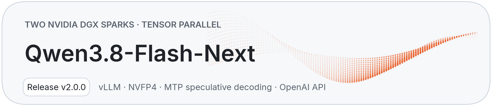
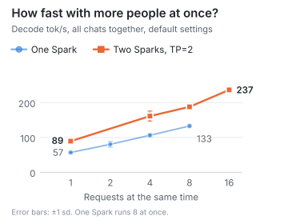
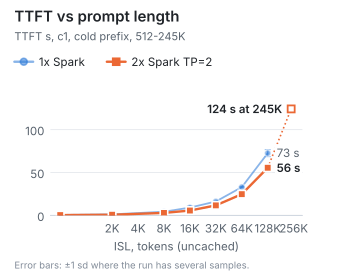
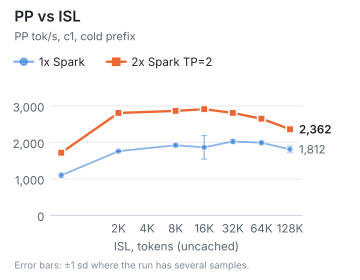
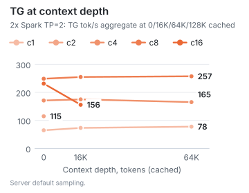
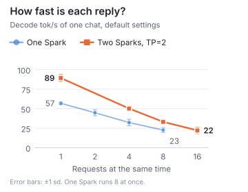
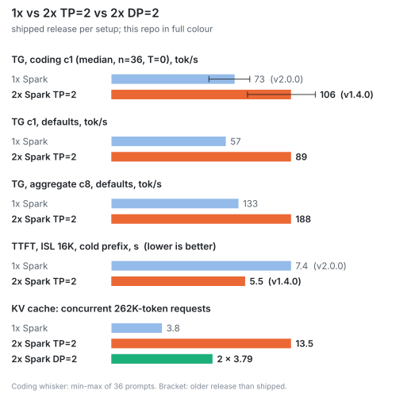
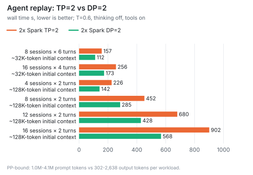
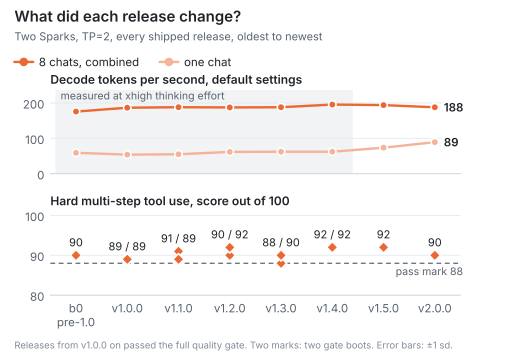

<!-- hero:start (scripts/make_charts.py writes this block) -->
<h1 align="center"></h1>
<!-- hero:end -->

<p align="center">sparkrun recipe: Qwen3.8-Flash-Next (NVFP4 / MXFP8, MTP ×4) on 2x DGX Spark, TP=2 over CX-7.<br>vLLM with b12x GB10 kernels, OpenAI-compatible endpoint, quality-gated releases.</p>

<!-- numbers:start (scripts/make_charts.py writes this block) -->
<table align="center">
  <tr>
    <td align="center"><h2>89 / 119 tok/s</h2><b>TG c1</b><br><sub>defaults (ISL/OSL 2048/512)<br>/ T=0, thinking off (coding, median of 36)</sub></td>
    <td align="center"><h2>172 / 319 tok/s</h2><b>TG aggregate c8</b><br><sub>defaults (ISL/OSL 2048/512)<br>/ T=0, thinking off (coding)</sub></td>
    <td align="center"><h2>5.6 s</h2><b>TTFT, ISL 16K</b><br><sub>c1, cold prefix</sub></td>
    <td align="center"><h2>90/100</h2><b>Hardmode</b><br><sub>pass ≥ 88, T=0, thinking on</sub></td>
  </tr>
</table>

<p align="center"><sub>262K context, max_num_seqs 16, MTP ×4, OpenAI-compatible API, quality-gated releases</sub></p>

<sub>TG cells: server defaults (ISL/OSL 2048/512, T=1.0, thinking on) first, T=0 coding (36 prompts, thinking off) second. Means and medians only. Release v2.0.0.</sub>

<details>
<summary><sub>Measurement details</sub></summary>

| Metric | Value | Workload | Sampling | n | Release (date) | Source |
|---|--:|---|---|---|---|---|
| TG c1, defaults | 88.7 ± 2.6 tok/s | llama-benchy task mode, ISL/OSL 2048/512 | T=1.0, top-p 0.95, top-k 20, thinking on | 3 runs, 1 boot, mean | v2.0.0 (2026-10-10) | [results](results/k76-capability-matrix-20261010-1059/2x/) |
| TG c1, coding | 118.7 tok/s median | 36 prompts (Python, C++, Rust, Go), OSL ≤768 | T=0, thinking off | 36 prompts, median; mean of 3 runs | v2.0.0 (2026-10-10) | [results](results/k76-capability-matrix-20261010-1059/2x/) |
| TG c1, coding, defaults | 92.0 tok/s median | 36 prompts, OSL ≤768; 100/108 requests hit the 768-token cap inside thinking | server defaults, thinking on | 36 prompts, median; mean of 3 runs | v2.0.0 (2026-10-10) | [results](results/k76-capability-matrix-20261010-1059/2x/) |
| TG aggregate c8, defaults | 172.2 ± 16.3 tok/s | llama-benchy task mode, ISL/OSL 2048/512 | T=1.0, top-p 0.95, top-k 20, thinking on | 3 runs, 1 boot, mean | v2.0.0 (2026-10-10) | [results](results/k76-capability-matrix-20261010-1059/2x/) |
| TG aggregate c8, coding | 318.7 ± 2.7 tok/s | 36 prompts, OSL ≤768, c8 | T=0, thinking off | 3 runs, 1 boot, mean | v2.0.0 (2026-10-10) | [results](results/k76-capability-matrix-20261010-1059/2x/) |
| TTFT, ISL 16K | 5.64 ± 0.01 s | llama-benchy 0.4.1.dev4+g0d4de4271, c1, cold prefix | – | 3 runs, 1 boot, mean | v2.0.0 (2026-10-10) | [results](results/k76-capability-matrix-20261010-1059/2x/) |
| Hardmode | 90/100 | 88 multi-step tool-use scenarios; pass ≥ 88 | T=0, thinking on | 1 gate run | v2.0.0 (2026-10-09) | [BENCHMARKS](docs/BENCHMARKS.md) |

Method and full tables: [docs/BENCHMARKS.md](docs/BENCHMARKS.md).

</details>
<!-- numbers:end -->

<!-- badges:start (scripts/make_charts.py writes this block) -->
<p align="center">
  
  
  
  
</p>
<!-- badges:end -->

> **TP=2 or DP=2?** On the same two Sparks, DP=2 (two 1x replicas behind a router) has higher aggregate TG at c8
> (203.6 vs 172.2 tok/s) and c16 (240.9 vs 231.3 tok/s), and finished every agent-replay workload 29-37% sooner.
> TP=2 (this recipe) is faster at c1-c4 and holds more long contexts: 13.46 concurrent 262K requests in one KV cache
> against 2 × 3.79 for DP=2. k76, 2026-10-10, ISL/OSL 2048/512, server defaults; agent replay 2026-10-08.
> Details: [1x vs 2x TP=2 vs 2x DP=2](#1x-vs-2x-tp2-vs-2x-dp2).

## Quick start

Requirements:

- 2x DGX Spark with the ConnectX-7 ports cabled back to back, [sparkrun](https://github.com/eugr/sparkrun) ≥ 0.3.6
  with a two-node cluster defined.
- Kernel `6.17.0-1032-nvidia` on both nodes; `7.0.0-1019-nvidia` breaks NCCL (`ibv_reg_mr` fails past ~85 GB
  GPU-resident).
- `loginctl enable-linger nvidia` on both nodes (otherwise logind removes the shared-memory ring buffer).
- ~140 GB free per node: 98 GiB checkpoint + 2.8 GB MXFP8 shard + 30.9 GB image.

```sh
sparkrun registry add https://github.com/ursuciprian/qwen3.8-flash-next-dgx-spark-tp-2
sparkrun run qwen3.8-flash-next-2x-dgx-spark
```

First run downloads ~140 GB per node (time depends on the link; a 98 GB checkpoint download took 3 h 15 min at
~8.6 MB/s on mine). Boot with model and image on disk: ~3 min (170 s on the v2.0.0 image check); a cold-page-cache boot
was not timed on v2.0.0. `sparkrun run` returns before the
engine is ready: poll `http://<head>:8000/health` (`<head>` = first node), then use `http://<head>:8000/v1`,
model `qwen3.8-flash-next`:

```sh
curl http://<head>:8000/v1/chat/completions -H 'Content-Type: application/json' \
  -d '{"model": "qwen3.8-flash-next", "messages": [{"role": "user", "content": "Hello"}]}'
```

No API key: keep it on a trusted network or put an authenticating proxy in front.

<details>
<summary>Check that it works, stop, upgrade, secure</summary>

`sparkrun run` returns before the engine is ready; wait
for health, then check that a reply has both reasoning and an answer:

```sh
H=http://<head>:8000
until [ "$(curl -s -o /dev/null -w '%{http_code}' $H/health)" = 200 ]; do sleep 10; done
curl -s $H/v1/chat/completions -H 'Content-Type: application/json' -d '{
  "model":"qwen3.8-flash-next","max_tokens":1024,
  "messages":[{"role":"user","content":"Write a Python function that reverses a string."}]}' \
| python3 -c "import json,sys; m=json.load(sys.stdin)['choices'][0]['message']
print('reasoning:', len(m.get('reasoning') or m.get('reasoning_content') or ''), 'chars')
print('content  :', (m.get('content') or '')[:300])"
```

Empty `content` with long reasoning means `max_tokens` ran out inside thinking; garbled text means a checkpoint
mismatch (see Troubleshooting under Details below). Optional long-context check (stdlib Python), expect `exact 20` at
both depths:

```sh
git clone https://github.com/ursuciprian/qwen3.8-flash-next-dgx-spark-tp-2 && cd qwen3.8-flash-next-dgx-spark-tp-2
python3 scripts/fidelity_probe.py --base $H --model qwen3.8-flash-next --depths 8000,32000
```

The server binds 0.0.0.0 with no API key: keep it on a trusted network or put a proxy with auth in front. Stop with
`sparkrun stop --all`. To upgrade, run `sparkrun registry update qwen38-flashnext` first: sparkrun caches registries
and does not refresh them on `run`.

> This repo still has copies of the single-Spark recipes `qwen3.8-flash-next-1x-dgx-spark` and `-previous`, so
> existing setups keep working; new one-Spark releases ship only in the
> [one-Spark repo](https://github.com/ursuciprian/qwen3.8-flash-next-1x-dgx-spark). With both registries added, use
> `@qwen38-flashnext-1x/qwen3.8-flash-next-1x-dgx-spark`.

</details>

## At a glance

| | |
|---|---|
| **Model** | [`ursuciprian/Qwen3.8-Flash-Next-NVFP4-GDN-MSE`](https://huggingface.co/ursuciprian/Qwen3.8-Flash-Next-NVFP4-GDN-MSE) @ `16c9bd54`: NVFP4 experts, MXFP8 dense and attention, GDN projections NVFP4 for TG and MXFP8 for PP |
| **MTP** | MTP ×4, probabilistic drafts, rejection sampling; drafter D1 refit on the served model's outputs |
| **Hardware** | 2x DGX Spark (GB10, 128 GB unified each), CX-7 back to back |
| **Parallelism** | TP=2 over RoCE, one rank per GB10 |
| **Engine** | vLLM + b12x (NVFP4 MoE, MXFP8 linears, GDN, QSA), plan and compile caches baked into the image |
| **Context** | 262,144 tokens (max_model_len) |
| **Concurrent requests** | up to 16 (max_num_seqs) |
| **KV cache** | 3,527,297 tokens, 13.46 concurrent 262K requests (v2.0.0 boot log) |
| **API** | OpenAI-compatible, tool calling, reasoning on (`reasoning_effort` medium) |
| **Disk / start time** | ~140 GB per node / ~3 min warm (170 s on the v2.0.0 image check) |
| **License** | Recipe Apache-2.0; weights Qwen Community License 1.0 |

| Task | Section |
|---|---|
| TG, PP, TTFT, context depth | [Performance](#performance) |
| Sizing: 1x vs TP=2 vs DP=2 | [1x vs 2x TP=2 vs 2x DP=2](#1x-vs-2x-tp2-vs-2x-dp2) |
| Quality gate results | [Quality gate](#quality-gate) |
| Raw data and provenance per number | [Every number and where it comes from](#every-number-and-where-it-comes-from) |
| Pin or roll back a release | [Recipes](#details), [VERSIONS.md](VERSIONS.md) |

## Performance

Aggregate TG scales to c16 while per-request TG drops. TTFT grows with ISL on a cold prefix; multi-turn
requests hit the prefix cache and run PP only on the new tokens.

<!-- speed:start (scripts/make_charts.py writes this block) -->
<p align="center">
<picture><source media="(prefers-color-scheme: dark)" srcset="docs/img/throughput-dark.svg"></picture>
<picture><source media="(prefers-color-scheme: dark)" srcset="docs/img/latency-dark.svg"></picture>
</p>

<sub>Left: 1x Spark v2.1.0, 2x Spark TP=2 v2.0.0, 2x Spark DP=2 v2.1.0; llama-benchy task mode. Right: 1x Spark v2.1.0, 2x Spark TP=2 v2.0.0/v1.4.0; c1, cold prefix.</sub>

<details>
<summary><sub>Runs, method and raw data</sub></summary>

<sub>Left: llama-benchy task mode (agent coding turn), ISL/OSL 2048/512, T=1.0, top-p 0.95, top-k 20, thinking on, prefix caching. Aggregate = all output tokens / wall time, PP included; per request = TG rate of one stream after its first token.<br>1x Spark: release v2.1.0, 2026-10-08, llama-benchy task mode, mean ± sd over runs, one boot<br>2x Spark TP=2: release v2.0.0, 2026-10-10, llama-benchy 0.4.1.dev4+g0d4de4271, mean ± sd of 3 runs, one boot<br>2x Spark DP=2: release v2.1.0, 2026-10-10, llama-benchy 0.4.1.dev4+g0d4de4271, mean ± sd of 3 runs, one boot<br>Versions are numbered per setup. Data: [docs/data/capability.csv](docs/data/capability.csv), with the source file of every point.<br><br>Right: c1, cold prefix (no cache hit). Each point: mean of 1 to 4 samples of one run (n per point in the CSV).<br>1x Spark: release v2.1.0, 2026-10-10, llama-benchy 0.4.1.dev4+g0d4de4271<br>2x Spark TP=2: release v2.0.0, 2026-10-10, llama-benchy 0.4.1.dev4+g0d4de4271; v1.4.0, 2026-10-07, fidelity_probe.py<br>1x Spark: not measured above 128K yet.<br>Data: [docs/data/capability.csv](docs/data/capability.csv), with the source file of every point.</sub>

</details>
<!-- speed:end -->

<!-- context:start (scripts/make_charts.py writes this block) -->
<p align="center">
<picture><source media="(prefers-color-scheme: dark)" srcset="docs/img/prefill-dark.svg"></picture>
<picture><source media="(prefers-color-scheme: dark)" srcset="docs/img/depth-dark.svg"></picture>
</p>

<sub>Left: 1x Spark v2.1.0, 2x Spark TP=2 v2.0.0; c1, cold prefix. Right: 2x Spark TP=2 v2.0.0; llama-benchy, ISL/OSL 2048/512 at depth.</sub>

<details>
<summary><sub>Runs, method and raw data</sub></summary>

<sub>Left: c1, cold prefix (no cache hit). Each point: mean of 1 to 4 samples of one run (n per point in the CSV).<br>1x Spark: release v2.1.0, 2026-10-10, llama-benchy 0.4.1.dev4+g0d4de4271<br>2x Spark TP=2: release v2.0.0, 2026-10-10, llama-benchy 0.4.1.dev4+g0d4de4271<br>Data: [docs/data/capability.csv](docs/data/capability.csv), with the source file of every point.<br><br>Right: 2x Spark TP=2: release v2.0.0, 2026-10-10, llama-benchy 0.4.1.dev4+g0d4de4271, mean ± sd of 3 runs, one boot. Server default sampling. Each point: ISL/OSL 2048/512 on top of the cached context, same harness as the concurrency chart. Concurrency levels measured at one depth only are left out.<br>Data: [docs/data/capability.csv](docs/data/capability.csv), with the source file of every point.</sub>

</details>
<!-- context:end -->

<details>
<summary>Per-request TG and the numbers behind the charts</summary>

<!-- perchat:start (scripts/make_charts.py writes this block) -->
<p align="center">
<picture><source media="(prefers-color-scheme: dark)" srcset="docs/img/perchat-dark.svg"></picture>
</p>

<sub>1x Spark v2.1.0, 2x Spark TP=2 v2.0.0, 2x Spark DP=2 v2.1.0; llama-benchy task mode.</sub>

<details>
<summary><sub>Runs, method and raw data</sub></summary>

<sub>llama-benchy task mode (agent coding turn), ISL/OSL 2048/512, T=1.0, top-p 0.95, top-k 20, thinking on, prefix caching. Aggregate = all output tokens / wall time, PP included; per request = TG rate of one stream after its first token.<br>1x Spark: release v2.1.0, 2026-10-08, llama-benchy task mode, mean ± sd over runs, one boot<br>2x Spark TP=2: release v2.0.0, 2026-10-10, llama-benchy 0.4.1.dev4+g0d4de4271, mean ± sd of 3 runs, one boot<br>2x Spark DP=2: release v2.1.0, 2026-10-10, llama-benchy 0.4.1.dev4+g0d4de4271, mean ± sd of 3 runs, one boot<br>Versions are numbered per setup. Data: [docs/data/capability.csv](docs/data/capability.csv), with the source file of every point.</sub>

</details>
<!-- perchat:end -->

<!-- matrix:start (scripts/make_charts.py writes this block) -->
| Concurrency | TG tok/s, aggregate | TG tok/s, per request | Release, run |
|--:|--:|--:|---|
| 1 | 88.7 ± 2.6 | 88.7 ± 2.6 | [v2.0.0, 2026-10-10](results/k76-capability-matrix-20261010-1059/2x/) |
| 2 | 114.9 ± 7.9 | 62.4 ± 5.3 | [v2.0.0, 2026-10-10](results/k76-capability-matrix-20261010-1059/2x/) |
| 4 | 156.6 ± 4.6 | 48.6 ± 1.5 | [v2.0.0, 2026-10-10](results/k76-capability-matrix-20261010-1059/2x/) |
| 8 | 172.2 ± 16.3 | 33.2 ± 1.0 | [v2.0.0, 2026-10-10](results/k76-capability-matrix-20261010-1059/2x/) |
| 16 | 231.3 ± 4.9 | 22.1 ± 0.4 | [v2.0.0, 2026-10-10](results/k76-capability-matrix-20261010-1059/2x/) |

Release v2.0.0. llama-benchy task mode, ISL/OSL 2048/512, T=1.0, thinking on; mean ± sd, where sd is between runs or between boots as the CSV `stat` column says for each run.

| ISL | PP tok/s | TTFT s | Release, run |
|--:|--:|--:|---|
| 512 | 1,718 ± 19 | 0.3 ± 0.0 | [v2.0.0, 2026-10-10, llama-benchy 0.4.1.dev4+g0d4de4271](results/k76-capability-matrix-20261010-1059/2x/) |
| 2K | 2,809 ± 41 | 0.7 ± 0.0 | [v2.0.0, 2026-10-10, llama-benchy 0.4.1.dev4+g0d4de4271](results/k76-capability-matrix-20261010-1059/2x/) |
| 8K | 2,865 ± 14 | 2.9 ± 0.0 | [v2.0.0, 2026-10-10, llama-benchy 0.4.1.dev4+g0d4de4271](results/k76-capability-matrix-20261010-1059/2x/) |
| 16K | 2,913 ± 7 | 5.6 ± 0.0 | [v2.0.0, 2026-10-10, llama-benchy 0.4.1.dev4+g0d4de4271](results/k76-capability-matrix-20261010-1059/2x/) |
| 32K | 2,810 ± 5 | 11.7 ± 0.0 | [v2.0.0, 2026-10-10, llama-benchy 0.4.1.dev4+g0d4de4271](results/k76-capability-matrix-20261010-1059/2x/) |
| 64K | 2,651 ± 2 | 24.8 ± 0.0 | [v2.0.0, 2026-10-10, llama-benchy 0.4.1.dev4+g0d4de4271](results/k76-capability-matrix-20261010-1059/2x/) |
| 128K | 2,362 ± 3 | 55.5 ± 0.1 | [v2.0.0, 2026-10-10, llama-benchy 0.4.1.dev4+g0d4de4271](results/k76-capability-matrix-20261010-1059/2x/) |

c1, cold prefix.
<!-- matrix:end -->

</details>

## 1x vs 2x TP=2 vs 2x DP=2

<!-- setups:start (scripts/make_charts.py writes this block) -->
<p align="center">
<picture><source media="(prefers-color-scheme: dark)" srcset="docs/img/setups-dark.svg"></picture>
</p>

<sub>Shipped release of each setup where measured; the bracket names an older release.</sub>

<details>
<summary><sub>Runs, method and raw data</sub></summary>

<sub>TG, coding c1 (median, n=36, T=0): 1x v2.1.0, 2026-10-10, coding_probe.py, up to 768 tokens out; TP=2 v2.0.0, 2026-10-10, coding_probe.py, up to 768 tokens out; not measured: 2x Spark DP=2.<br>TG c1, defaults: 1x v2.1.0, 2026-10-10, llama-benchy 0.4.1.dev4+g0d4de4271; TP=2 v2.0.0, 2026-10-10, llama-benchy 0.4.1.dev4+g0d4de4271; DP=2 v2.1.0, 2026-10-10, llama-benchy 0.4.1.dev4+g0d4de4271.<br>TG, aggregate c8, defaults: 1x v2.1.0, 2026-10-10, llama-benchy 0.4.1.dev4+g0d4de4271; TP=2 v2.0.0, 2026-10-10, llama-benchy 0.4.1.dev4+g0d4de4271; DP=2 v2.1.0, 2026-10-10, llama-benchy 0.4.1.dev4+g0d4de4271.<br>TTFT, ISL 16K, cold prefix: 1x v2.1.0, 2026-10-10, llama-benchy 0.4.1.dev4+g0d4de4271; TP=2 v2.0.0, 2026-10-10, llama-benchy 0.4.1.dev4+g0d4de4271; not measured: 2x Spark DP=2.<br>KV cache: concurrent 262K-token requests: 1x v2.1.0, 2026-10-08, serve log; TP=2 v2.0.0, 2026-10-09, serve log; DP=2 v2.1.0, 2026-10-08, serve log.<br>TG c1/c8: llama-benchy task mode, ISL/OSL 2048/512, server defaults. KV row: vLLM's 'Maximum concurrency for 262,144 tokens per request' at boot (DP=2: two replicas, one pool each).<br>Data: [docs/data/capability.csv](docs/data/capability.csv), with the source file of every point.</sub>

</details>
<!-- setups:end -->

- **1x:** [1x recipe](https://github.com/ursuciprian/qwen3.8-flash-next-1x-dgx-spark), max_num_seqs 8.
- **2x TP=2 (this recipe):** higher per-request TG and a larger KV cache; fits low concurrency and long contexts.
- **2x DP=2:** two 1x replicas behind the [router](tools/dp2/README.md). Lower wall time than TP=2 on all six
  agent-replay workloads:

<!-- agents:start (scripts/make_charts.py writes this block) -->
<p align="center">
<picture><source media="(prefers-color-scheme: dark)" srcset="docs/img/agents-dark.svg"></picture>
</p>

<sub>Agent replay, one boot per layout: two-Spark v1.5.0 (old name b1.6) (TP=2); DP=2 on one-Spark v2.1.0 (old name v3e) (DP=2).</sub>

<details>
<summary><sub>Runs, method and raw data</sub></summary>

<sub>All sessions start at once; each turn resends the full conversation (prefix cache on), tools on, T=0.6, thinking off.<br>2x Spark TP=2: two-Spark v1.5.0 (old name b1.6), 2026-10-08, agent replay (drive.py), one boot<br>2x Spark DP=2: DP=2 on one-Spark v2.1.0 (old name v3e), 2026-10-08, agent replay (drive.py), one boot<br>Data: [docs/data/capability.csv](docs/data/capability.csv), with the source file of every point.</sub>

</details>
<!-- agents:end -->

## Quality gate

<!-- quality:start (scripts/make_charts.py writes this block) -->
| Check | Result | Criterion |
|---|---|---|
| Hardmode | **90/100** | score /100, pass ≥ 88 (88 scenarios), T=0, thinking on |
| TC-45 | **100/100** | regression test (1 scenario, 2 pts, 5 trials) |
| Fidelity | **20/20** | 20 needles retrieved via tool calls, ISL 8K to ~245K |
| Stragglers | **none** | no stalled request at c8-c16 |

Gate run: release v2.0.0, 2026-10-09. Every release passes this gate before promotion.
<!-- quality:end -->

Full gate tables: [docs/BENCHMARKS.md](docs/BENCHMARKS.md).

## Release history

<!-- history:start (scripts/make_charts.py writes this block) -->
<p align="center">
<picture><source media="(prefers-color-scheme: dark)" srcset="docs/img/history-dark.svg"></picture>
</p>

<sub>Each release's own promotion run and gate; shaded: reasoning_effort xhigh.</sub>

<details>
<summary><sub>Runs, method and raw data</sub></summary>

<sub>TG: llama-benchy task mode, ISL/OSL 2048/512, T=1.0, thinking on, from each release's own promotion run (unpaired across releases, so day-to-day drift is included; paired A/B per release in [VERSIONS.md](VERSIONS.md)).<br>Shaded (b0 to v1.4.0): chat template default reasoning_effort xhigh; later releases at the recipe default, medium. Different reasoning lengths, so not like-for-like across the shade.<br>TG runs: b0 2026-09-23 (llama-benchy task mode, mean ± sd over runs, one boot); v1.0.0 2026-09-25, v1.1.0 2026-09-26, v1.2.0 2026-09-27, v1.3.0 2026-09-29 (llama-benchy task mode, mean of 2 candidate boots x 3 runs; sd not recorded); v1.4.0 2026-10-01 (llama-benchy task mode, mean of 2 boots x 3 runs, sd between boots); v1.5.0 2026-10-08, v2.0.0 2026-10-09 (llama-benchy task mode, mean of 2 boots x 4 runs, sd between boots).<br>Hardmode: promotion gate of each release (b0: gate on the pinned checkpoint), b0 2026-09-23, v1.0.0 2026-09-25, v1.1.0 2026-09-26, v1.2.0 2026-09-27, v1.3.0 2026-09-29, v1.4.0 2026-10-01, v1.5.0 2026-10-08, v2.0.0 2026-10-09.<br>Data: [docs/data/capability.csv](docs/data/capability.csv), with the source file of every point.</sub>

</details>
<!-- history:end -->

## Stack

- **Weights:** NVFP4 experts, MXFP8 dense and attention. GDN projections in weight-only NVFP4 for calls under 41
  rows (TG up to c8), MXFP8 copy for 41+ rows (PP; TG at c9-c16).
- **MTP:** 4 probabilistic drafts per step over a 131k-id draft vocabulary, rejection sampling (output
  distribution unchanged); drafter D1 refit on the served model's outputs.
- **Parallelism:** TP=2 over RoCE (CX-7), one rank per GB10; all-reduce ~4% of a c1 TG step.
- **Kernels:** b12x for GB10 (NVFP4 MoE, MXFP8 linears, 36 GDN layers, 12 QSA sparse-attention layers), autotuned
  plan cache baked into the image.
- **Serving defaults:** reasoning on at `reasoning_effort` medium, tool calling, max_model_len 262,144.

## Details

<details>
<summary><b>Every number and where it comes from</b>: Capability table for one Spark, TP=2 and DP=2, with the run behind each number</summary>

### Every number and where it comes from

The shipped releases were measured as a full grid in k76 on 2026-10-10
([#128](https://github.com/ursuciprian/qwen3.8-flash-next-dgx-spark-tp-2/issues/128)); where a cell has no k76 value,
the table shows the newest release that has one.
TG rows are aggregate unless marked "per request"; sampling is the server default (temperature 1.0,
thinking on) unless the run says otherwise. The charts and tables are written by
`uv run scripts/make_charts.py` from [`docs/data/capability.csv`](docs/data/capability.csv), where every point lists
its raw file. Full grids for every build: [docs/BENCHMARKS.md](docs/BENCHMARKS.md).

<!-- capability-table:start (scripts/make_charts.py writes this block) -->
| | 1x Spark | 2x Spark TP=2 | 2x Spark DP=2 |
|---|---|---|---|
| TG c1, tok/s | 56.9 <sup>a</sup> | 88.7 <sup>b</sup> | 57.5 <sup>c</sup> |
| TG c4, tok/s: per request / aggregate | 32.4 <sup>a</sup> / 111.4 <sup>a</sup> | 48.6 <sup>b</sup> / 156.6 <sup>b</sup> | 43.4 <sup>c</sup> / 137.5 <sup>c</sup> |
| TG c8, tok/s: per request / aggregate | 22.0 <sup>a</sup> / 132.9 <sup>a</sup> | 33.2 <sup>b</sup> / 172.2 <sup>b</sup> | 32.5 <sup>c</sup> / 203.6 <sup>c</sup> |
| TG c16, tok/s: per request / aggregate | > max_num_seqs 8 | 22.1 <sup>b</sup> / 231.3 <sup>b</sup> | 21.7 <sup>c</sup> / 240.9 <sup>c</sup> |
| TG, coding c1 (36 prompts), tok/s median: T=0 / defaults | 77 <sup>d</sup> / 61 <sup>d</sup> | 119 <sup>e</sup> / 92 <sup>e</sup> | not measured |
| Copy-heavy (MTP acceptance near 1), aggregate tok/s c1 / c4 / c8, mean | 80.8 <sup>f</sup> / 183.5 <sup>f</sup> / 274.1 <sup>f</sup> | 120.5 <sup>g</sup> / 303.5 <sup>g</sup> / 453.4 <sup>g</sup> | not measured |
| PP tok/s, ISL 2K / 16K / 64K / 128K, c1 | 1,760 <sup>a</sup> / 1,866 <sup>a</sup> / 1,993 <sup>a</sup> / 1,812 <sup>a</sup> | 2,809 <sup>b</sup> / 2,913 <sup>b</sup> / 2,651 <sup>b</sup> / 2,362 <sup>b</sup> | not measured |
| TTFT s, ISL 2K / 16K / 64K / 128K, cold prefix | 1.2 <sup>a</sup> / 9.1 <sup>a</sup> / 32.9 <sup>a</sup> / 72.5 <sup>a</sup> | 0.7 <sup>b</sup> / 5.6 <sup>b</sup> / 24.8 <sup>b</sup> / 55.5 <sup>b</sup> | not measured |
| ITL p50, ms, c1 / c8 (MTP emits several tokens per step) | 19 <sup>h</sup> / 47 <sup>h</sup> | 13 <sup>i</sup> / 31 <sup>i</sup> | 19 <sup>j</sup> / 48 <sup>j</sup> |
| Stream chunk gap p50, ms, c1 / c8 | 56 <sup>k</sup> / 143 <sup>k</sup> | 41 <sup>l</sup> / 90 <sup>l</sup> | not measured |
| TG aggregate tok/s, depth 0 → 64K, c1 / c4 | 56.9 <sup>a</sup> → 55.6 <sup>a</sup> / 111.4 <sup>a</sup> → 98.4 <sup>a</sup> | 88.7 <sup>b</sup> → 82.8 <sup>b</sup> / 156.6 <sup>b</sup> → 104.3 <sup>b</sup> | 57.5 <sup>c</sup> → – / 137.5 <sup>c</sup> → – |
| max_model_len | 262,144 (recipe) | 262,144 (recipe) | 262,144 (recipe) |
| KV cache, tokens | 993,754 <sup>m</sup> | 3,525,633 <sup>n</sup> | 1,987,508 <sup>o</sup> |
| Concurrent 262K requests in KV (vLLM count) | 3.79 <sup>p</sup> | 13.46 <sup>q</sup> | 2 × 3.79 <sup>r</sup> |
| Requests that fit KV at 16K / 64K / 128K | 39.7 <sup>s</sup> / 14.1 <sup>s</sup> / 7.5 <sup>s</sup> | not measured | not measured |
| Gate: hardmode / TC-45 / fidelity to ~245K / stragglers | 91 <sup>t</sup> / 100 <sup>t</sup> / 20/20 (one of three ~245K seeds 19/20) <sup>t</sup> / none, c8-c16 <sup>t</sup> | 90 <sup>u</sup> / 100 <sup>u</sup> / 20/20 <sup>u</sup> / none, c8-c16 <sup>u</sup> | 93 <sup>v</sup> / 100 <sup>v</sup> / 20/20 <sup>v</sup> / none, c5-c16 <sup>v</sup> |

Releases and runs behind the numbers:

- <sup>a</sup> one-Spark v2.1.0 (old name v3e), 2026-10-10, k76-capability-matrix, llama-benchy 0.4.1.dev4+g0d4de4271 ([files](results/k76-capability-matrix-20261010-1059/))
- <sup>b</sup> two-Spark v2.0.0, 2026-10-10, k76-capability-matrix, llama-benchy 0.4.1.dev4+g0d4de4271 ([files](results/k76-capability-matrix-20261010-1059/2x/))
- <sup>c</sup> DP=2 on one-Spark v2.1.0 (old name v3e), 2026-10-10, k76-capability-matrix, llama-benchy 0.4.1.dev4+g0d4de4271 ([files](results/k76-capability-matrix-20261010-1059/dp2/))
- <sup>d</sup> one-Spark v2.1.0 (old name v3e), 2026-10-10, k76-capability-matrix, coding_probe.py, up to 768 tokens out ([files](results/k76-capability-matrix-20261010-1059/))
- <sup>e</sup> two-Spark v2.0.0, 2026-10-10, k76-capability-matrix, coding_probe.py, up to 768 tokens out ([files](results/k76-capability-matrix-20261010-1059/2x/))
- <sup>f</sup> one-Spark v2.1.0 (old name v3e), 2026-10-10, k76-capability-matrix, copy-heavy benchmark, 1,500 tokens out ([files](results/k76-capability-matrix-20261010-1059/))
- <sup>g</sup> two-Spark v2.0.0, 2026-10-10, k76-capability-matrix, copy-heavy benchmark, 1,500 tokens out ([files](results/k76-capability-matrix-20261010-1059/2x/))
- <sup>h</sup> one-Spark v2.1.0 (old name v3e), 2026-10-10, k76-capability-matrix, llm-inference-bench 0.7.6 ([files](results/k76-capability-matrix-20261010-1059/))
- <sup>i</sup> two-Spark v2.0.0, 2026-10-10, k76-capability-matrix, llm-inference-bench 0.7.6 ([files](results/k76-capability-matrix-20261010-1059/2x/))
- <sup>j</sup> DP=2 on one-Spark v2.1.0 (old name v3e), 2026-10-10, k76-capability-matrix, llm-inference-bench 0.7.6 ([files](results/k76-capability-matrix-20261010-1059/dp2/))
- <sup>k</sup> one-Spark v2.0.0 (old name v3d), 2026-10-05, depth and PP sweep, llm-inference-bench 0.7.6 ([files](https://github.com/ursuciprian/qwen3.8-flash-next-1x-dgx-spark/tree/main/results/tp1-v3d-20261005/bench/))
- <sup>l</sup> two-Spark v1.4.0 (old name b1.4), 2026-10-05, depth and PP sweep, llm-inference-bench 0.7.6 ([files](results/lib-bench-20261005/tp2-b1.4/))
- <sup>m</sup> one-Spark v2.1.0 (old name v3e), 2026-10-10, k76-capability-matrix, vLLM serve log ([files](results/k76-capability-matrix-20261010-1059/))
- <sup>n</sup> two-Spark v2.0.0, 2026-10-10, k76-capability-matrix, vLLM serve log ([files](results/k76-capability-matrix-20261010-1059/2x/))
- <sup>o</sup> DP=2 on one-Spark v2.1.0 (old name v3e), 2026-10-10, k76-capability-matrix, vLLM serve log ([files](results/k76-capability-matrix-20261010-1059/))
- <sup>p</sup> one-Spark v2.1.0 (old name v3e), 2026-10-08, serve log ([files](results/dp2-gate-k72-20261008-1135/))
- <sup>q</sup> two-Spark v2.0.0, 2026-10-09, serve log ([files](results/k77-2x-ship-check-20261009-2149/check/))
- <sup>r</sup> DP=2 on one-Spark v2.1.0 (old name v3e), 2026-10-08, serve log ([files](results/dp2-gate-k72-20261008-1135/))
- <sup>s</sup> one-Spark v1.3.0 (old name v3c), 2026-10-05, kv-capacity page accounting, same 14 GiB pool in 1× v2.0.0 and v2.1.0 ([files](https://github.com/ursuciprian/qwen3.8-flash-next-1x-dgx-spark/tree/main/results/tp1-v3c-20261005/))
- <sup>t</sup> one-Spark v2.1.0 (old name v3e), 2026-10-07, promotion gate ([files](https://github.com/ursuciprian/qwen3.8-flash-next-1x-dgx-spark/blob/main/docs/BENCHMARKS.md))
- <sup>u</sup> two-Spark v2.0.0, 2026-10-09, promotion gate ([files](docs/BENCHMARKS.md))
- <sup>v</sup> DP=2 on one-Spark v2.1.0 (old name v3e), 2026-10-08, quality gate through the router ([files](results/dp2-gate-k72-20261008-1135/))
<!-- capability-table:end -->

</details>

<details>
<summary><b>Requirements</b>: Hardware, disk, kernel, host settings, boot time, checkpoint</summary>

| | |
|---|---|
| **Hardware** | Two DGX Sparks (GB10, 128 GB unified), CX-7 ports cabled back to back |
| **Launcher** | sparkrun ≥ 0.3.6 with a two-node cluster defined |
| **Disk** | ~140 GB per node (98 GiB checkpoint + 2.8 GB MXFP8 shard of 7c4f1bc1 + ~31 GB image) |
| **Kernel** | `6.17.0-1032-nvidia`. `7.0.0-1019-nvidia` breaks NCCL `ibv_reg_mr` past ~85 GB GPU-resident ([forum](https://forums.developer.nvidia.com/t/dgx-spark-regression-kernel-7-0-0-1019-nvidia-causes-nccl-roce-ibv-reg-mr-iova2-enomem-6-17-0-1032-works/383023)) |
| **Host setting** | `loginctl enable-linger nvidia` on both nodes (otherwise logind `RemoveIPC` kills the shm ring buffer) |
| **Boot** | ~3 min warm (170 s on the v2.0.0 image check); a cold-page-cache boot was not timed on v2.0.0 (v1.5.0: ~9.5 min) |
| **Concurrency** | `max_num_seqs` 16, KV pool 3,527,297 tokens on the v2.0.0 check boot (vLLM sizes it at each boot; v1.x boots logged 3.57M to 3.76M, and the per-rank MXFP8 copies of v2.0.0 take about 4%) |

Checkpoint: [`ursuciprian/Qwen3.8-Flash-Next-NVFP4-GDN-MSE`](https://huggingface.co/ursuciprian/Qwen3.8-Flash-Next-NVFP4-GDN-MSE)
@ `16c9bd54` (v2.0.0): [`local-inference-lab/Qwen3.8-Flash-Next-NVFP4`](https://huggingface.co/local-inference-lab/Qwen3.8-Flash-Next-NVFP4)
@ `7c4f1bc1` with the GDN projections requantized to weight-only NVFP4 and the retrained drafter D1 (NVFP4 experts;
MXFP8 dense and attention; 98 GiB). PP-sized GDN calls (41+ rows) use the MXFP8 GDN weights of 7c4f1bc1, read
from its shard 35, which the recipe downloads on the first boot. Image and video input are not tested.

</details>

<details>
<summary><b>Known limits</b>: What is not measured or does not work yet</summary>

- By vLLM's count the KV pool fits about 13.5 requests at 262,144 tokens, under the 16-request cap. Four different
  ~256K contexts at once used 28% of the pool; more than four at once have not been run
  ([long contexts at once](docs/BENCHMARKS.md#long-contexts-at-once-on-2-b14-2026-10-07)).
- v2.0.0 reads the MXFP8 PP weights from shard 35 of the 7c4f1bc1 snapshot in the HF cache by its full path.
  Deleting the HF cache means downloading that shard (2.8 GB) again on the next boot, which the recipe does by itself.
- The v2.0.0 A/B measured c1, c4 and c8 against v1.5.0; c16 was not part of the A/B. k76 measured the shipped
  v2.0.0 at c16: 231.3 ± 4.9 tok/s aggregate (v1.4.0 A/B: 242.8). At c9-c16 the GDN layers run the same MXFP8 weights
  as v1.5.0.
- c1 TG varies between boots (earlier builds showed two levels, ~95–100 and ~85–88 tok/s on counting).
- Hardmode still fails a few multi-step scenarios (e.g. TC-30, TC-68, TC-74, TC-88) on every release.
- Above 16 requests: a `max_num_seqs` 32 run (quality gate not run at that cap) reached 285.5 tok/s aggregate TG at c32
  (llama-benchy task mode, mean of 3 runs, v1.4.0; [high concurrency](docs/BENCHMARKS.md#high-concurrency-max_num_seqs-32-2026-10-05)).

</details>

<details>
<summary><b>Recipes</b>: The recipes in this repo and how to roll back</summary>

| Recipe | Release | Image | Use |
|---|---|---|---|
| [`qwen3.8-flash-next-2x-dgx-spark`](recipes/qwen3.8-flash-next/qwen3.8-flash-next-2x-dgx-spark.yaml) | v2.0.0 | `k73-20261009-21e0b201-d21d7ade-warm` (also `2x-v2.0.0`) | Default |
| [`qwen3.8-flash-next-2x-dgx-spark-previous`](recipes/qwen3.8-flash-next/qwen3.8-flash-next-2x-dgx-spark-previous.yaml) | v1.5.0 (old name b1.6) | `b1.6-20261008-b7fbaf96-a7e649d8-warm` | Rollback, 7c4f1bc1 checkpoint |
| `qwen3.8-flash-next-1x-dgx-spark`, `-previous` | one-Spark v2.1.0 / v2.0.0 | | Compatibility copies; the one-Spark recipes live in [qwen3.8-flash-next-1x-dgx-spark](https://github.com/ursuciprian/qwen3.8-flash-next-1x-dgx-spark) |

Rolling back to `-previous` needs the full 7c4f1bc1 checkpoint (98.5 GiB) in the HF cache; on a pair that ran v1.5.0 before, it boots warm. Renames: [recipes/RENAMES.md](recipes/RENAMES.md).

</details>

<details>
<summary><b>Releases</b>: Version names and what each release changed</summary>

Releases use semantic versions per repo; [VERSIONS.md](VERSIONS.md) lists every shipped release with its old build
name, date, what changed and its manifest (image digest, vLLM and b12x commits, checkpoint, drafter, plan seed).
Each release's own A/B against the one before it is in the [release history](#release-history) and in
[docs/BENCHMARKS.md](docs/BENCHMARKS.md). The single-Spark releases have their own list in the
[one-Spark repo](https://github.com/ursuciprian/qwen3.8-flash-next-1x-dgx-spark/blob/main/VERSIONS.md).

</details>

<details>
<summary><b>How I measure</b>: How builds are screened, compared and promoted</summary>

- Candidate builds are screened with [Thunderdome](docs/THUNDERDOME.md): control and candidate booted alternately
  (control, candidate, candidate, control), T=0 TG probes at c1/c4/c8 and at 16K context, plus llama-benchy
  at temperature 1.0. Noise band = the control's boot-to-boot spread, at least 1%.
- To be promoted, a build must pass the gate, be faster beyond noise in at least one cell, and be slower beyond
  noise in no cell at 1–4 requests; a loss at 5–16 requests is published as a caveat
  ([`scripts/arm_verdict.py`](scripts/arm_verdict.py)).
- MTP acceptance per draft position is compared cell by cell as a numerics canary.
- Copy-heavy and counting workloads accept nearly every draft and show the TG ceiling of MTP; the coding grid
  (llama-benchy task mode, thinking on) is the rate an agent sees. Every table states its workload.

Index of every run and verdict: [results/README.md](results/README.md).

</details>

<details>
<summary><b>How it works</b>: Parallelism, kernels, MTP, where the time goes</summary>

- TP=2 over RoCE, one rank per GB10; all-reduces over the CX-7 link take ~4% of a c1 TG step.
- b12x kernels cover NVFP4 MoE, MXFP8 linears, GDN (36 layers) and QSA sparse attention (12 layers), with an
  autotuned plan cache baked into each image.
- MTP ×4 uses probabilistic drafts over a 131k-id draft vocabulary; rejection sampling keeps the output distribution
  unchanged.
- The 1-request step (~43 ms) splits into MoE 30%, dense MXFP8 31%, MTP draft + head 19%, idle 6%, all-reduce 4%,
  GDN 3%. MoE reads ~175 GB/s of the ~250 GB/s the GB10 reaches.

Flags, environment variables and the reason for each: [docs/REFERENCE.md](docs/REFERENCE.md). Kernel and engine
notes, rejected experiments: [docs/ENGINEERING.md](docs/ENGINEERING.md).

</details>

<details>
<summary><b>Thinking effort</b>: The default reasoning effort and how to change it per request</summary>

The recipes set the server default to `reasoning_effort: medium`. On my DevOps task set, two-Spark v1.2.0 (old name b1.2) at the template
default `xhigh` passed 42.5% of checks with 23/42 runaway-thinking runs and a 246 s median per task; v1.4.0 (old name b1.4) at `medium`
passed 95.9% with 0/42 runaway and 33 s. A request can still ask for `xhigh` or `low`; `"reasoning_effort": "none"`
turns thinking off. For hard reasoning problems `xhigh` per request helps: on the hotel-lights check, the one-Spark v3c (old name)
went from 21/32 at `medium` to 31/31 completed runs
([#88](https://github.com/ursuciprian/qwen3.8-flash-next-dgx-spark-tp-2/issues/88)); allow a long client timeout,
since most of those answers took over 30 minutes at 8 concurrent requests. Override table:
[docs/REFERENCE.md](docs/REFERENCE.md#thinking-effort).

</details>

<details>
<summary><b>Troubleshooting</b>: Common errors and fixes</summary>

| Symptom | Fix |
|---|---|
| `/health` silent for minutes | Expected on a cold boot. `sparkrun logs <recipe> -f` |
| OOM / earlyoom at start | Unified memory: `gpu_memory_utilization` ≥ 0.84 starves host RAM. Keep 0.80 and clear other containers |
| NCCL `ibv_reg_mr_iova2 ... Cannot allocate memory` | Kernel `7.0.0-1019-nvidia`; hold `6.17.0-1032-nvidia` |
| `ShmRingBuffer ... shared_memory` crash | `loginctl enable-linger nvidia` on both nodes |
| Garbled output | Rank checkpoint mismatch: both serve logs must show `snapshots/16c9bd54` (`7c4f1bc1` on `-previous`) ([why](docs/REFERENCE.md#tuning-and-troubleshooting)) |
| Empty `content`, long reasoning | `max_tokens` ran out during thinking; raise it or send `"reasoning_effort": "low"` |
| Old release boots after an upgrade | `sparkrun registry update qwen38-flashnext` |
| Anything else | Try the `-previous` recipe, then open an issue with `sparkrun logs <recipe> -a` |

</details>

<details>
<summary><b>Docs</b>: Where the rest of the documentation is</summary>

| | |
|---|---|
| [VERSIONS.md](VERSIONS.md) | Release names, old build names, manifests |
| [docs/BENCHMARKS.md](docs/BENCHMARKS.md) | Full benchmark and quality tables for every build, method, history |
| [docs/REFERENCE.md](docs/REFERENCE.md) | Configuration, image provenance, thinking effort, tuning |
| [docs/ENGINEERING.md](docs/ENGINEERING.md) | Known issues and fixes, profiling, rejected experiments |
| [tools/dp2/](tools/dp2/README.md) | DP=2 router: how to run it, flags, limits |
| [results/](results/README.md) | Every raw measurement and verdict |
| [archive/](archive/recipes/README.md) | Experimental and superseded recipes (not listed by sparkrun) |

</details>

## Credits

This build stands on these projects:

- [local-inference-lab](https://github.com/local-inference-lab): the vLLM fork my branches start from, the b12x kernels (NVFP4 MoE, GDN, QSA) and the NVFP4 checkpoint (the one-Spark checkpoint is derived from it).
- [Qwen](https://huggingface.co/Qwen/Qwen3.8-Flash-Next): the base model, under the Qwen Community License 1.0.
- [eugr](https://github.com/eugr): spark-vllm-docker (my image base), sparkrun (the launcher), and llama-benchy (the base of my benchmark fork).
- [tonyd2wild](https://github.com/tonyd2wild): the bench_sweep counting harness behind the counting numbers.
- [SeraphimSerapis](https://github.com/SeraphimSerapis): tool-eval-bench, which runs the hardmode and TC-45 quality gate.

Earlier experiments drew on other projects too; [docs/ENGINEERING.md](docs/ENGINEERING.md#credits) keeps that full
history with exact pins.

## License

Apache-2.0, see [`LICENSE`](LICENSE). The vLLM overlays under `archive/mods/` keep their upstream Apache-2.0 headers.
Model weights are not part of this repo and keep their own license (Qwen Community License 1.0; see each checkpoint's
model card).
