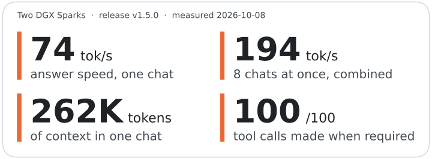
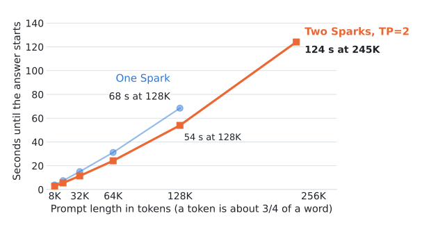
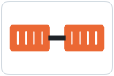
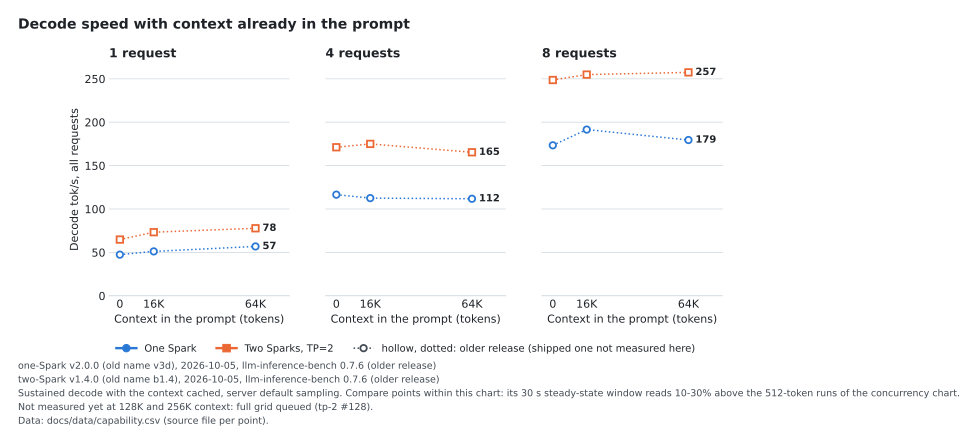
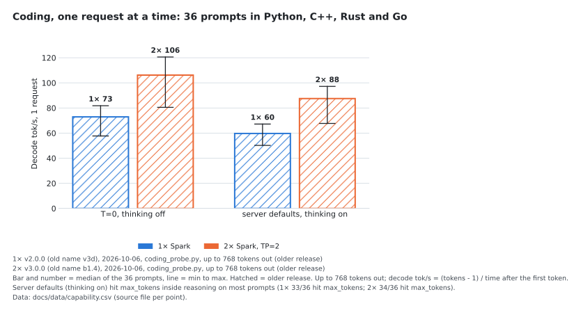
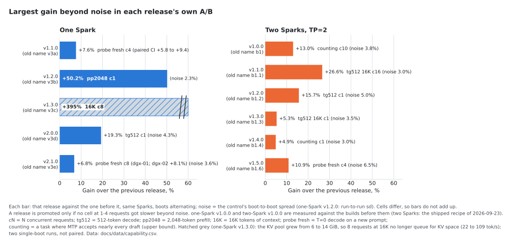

# Qwen3.8-Flash-Next on two DGX Sparks

A ready-made recipe that runs Qwen3.8-Flash-Next on two NVIDIA DGX Sparks as one private, OpenAI-compatible
server, for chat, coding and agents. Two commands to start.

<!-- hero:start (scripts/make_charts.py writes this block) -->


<sub>tok/s = tokens per second; a token is about 3/4 of a word. Speed: release v1.5.0, 2026-10-08, llama-benchy task mode, each chat sends 2,048 tokens and gets 512 back. Tool calls: TC-45, release v1.5.0, 2026-10-08. Context: recipe max_model_len 262,144. Details: [docs/BENCHMARKS.md](docs/BENCHMARKS.md).</sub>
<!-- hero:end -->

## Quick start

You need two DGX Sparks joined by a cable between their fast network ports (ConnectX-7), and
[sparkrun](https://github.com/eugr/sparkrun) 0.3.6 or newer with the two Sparks set up as a cluster.

```sh
sparkrun registry add https://github.com/ursuciprian/qwen3.8-flash-next-dgx-spark-tp-2
sparkrun run qwen3.8-flash-next-2x-dgx-spark
```

The first start downloads the model and the image (about 130 GB per Spark), then boots in about 10 minutes; later
starts take about 4. `sparkrun run` returns before the server is ready. Once `http://<head>:8000/health` answers
(`<head>` is the hostname or IP of the first Spark), point any OpenAI client at `http://<head>:8000/v1`, model
`qwen3.8-flash-next`:

```sh
curl http://<head>:8000/v1/chat/completions -H 'Content-Type: application/json' \
  -d '{"model": "qwen3.8-flash-next", "messages": [{"role": "user", "content": "Hello"}]}'
```

The server has no API key, so keep it on a trusted network.

<details>
<summary>Check that it works, stop, upgrade, secure</summary>

`sparkrun run` returns before the engine is ready; wait
for health, then check that a reply has both reasoning and an answer:

```sh
H=http://<head>:8000
until [ "$(curl -s -o /dev/null -w '%{http_code}' $H/health)" = 200 ]; do sleep 10; done
curl -s $H/v1/chat/completions -H 'Content-Type: application/json' -d '{
  "model":"qwen3.8-flash-next","max_tokens":1024,
  "messages":[{"role":"user","content":"Write a Python function that reverses a string."}]}' \
| python3 -c "import json,sys; m=json.load(sys.stdin)['choices'][0]['message']
print('reasoning:', len(m.get('reasoning') or m.get('reasoning_content') or ''), 'chars')
print('content  :', (m.get('content') or '')[:300])"
```

Empty `content` with long reasoning means `max_tokens` ran out inside thinking; garbled text means a checkpoint
mismatch (see Troubleshooting under Details below). Optional long-context check (stdlib Python), expect `exact 20` at
both depths:

```sh
git clone https://github.com/ursuciprian/qwen3.8-flash-next-dgx-spark-tp-2 && cd qwen3.8-flash-next-dgx-spark-tp-2
python3 scripts/fidelity_probe.py --base $H --model qwen3.8-flash-next --depths 8000,32000
```

The server binds 0.0.0.0 with no API key: keep it on a trusted network or put a proxy with auth in front. Stop with
`sparkrun stop --all`. To upgrade, run `sparkrun registry update qwen38-flashnext` first: sparkrun caches registries
and does not refresh them on `run`.

> This repo still has copies of the single-Spark recipes `qwen3.8-flash-next-1x-dgx-spark` and `-previous`, so
> existing setups keep working; new one-Spark releases ship only in the
> [one-Spark repo](https://github.com/ursuciprian/qwen3.8-flash-next-1x-dgx-spark). With both registries added, use
> `@qwen38-flashnext-1x/qwen3.8-flash-next-1x-dgx-spark`.

</details>

## How fast is it?

<!-- speed-chart:start (scripts/make_charts.py writes this block) -->


<sub>Each user sends a 2,048-token prompt and gets 512 tokens back; default sampling, thinking on. Total = all tokens written per second; each reply = how fast one answer streams.<br>One Spark: release v2.1.0, 2026-10-08, llama-benchy task mode<br>Two Sparks, TP=2: release v1.5.0, 2026-10-08, llama-benchy task mode; hollow point: older release v1.4.0, 2026-10-01, llama-benchy task mode<br>Two Sparks, DP=2: not measured on this test yet.<br>Versions are numbered per setup. Data: [docs/data/capability.csv](docs/data/capability.csv), with the source file of every point.</sub>
<!-- speed-chart:end -->

The more people use it at once, the more text it writes in total, while each reply streams more slowly. One Spark
runs up to 8 chats at once, two Sparks up to 16; more requests wait in line.

## How long until the first word?

<!-- first-token-chart:start (scripts/make_charts.py writes this block) -->


<sub>One request with a prompt the server has not seen before. Later turns of a chat reuse the cached prompt and start sooner.<br>One Spark: release v2.0.0, 2026-10-05, llm-inference-bench 0.7.6<br>Two Sparks, TP=2: release v1.4.0, 2026-10-05, llm-inference-bench 0.7.6; v1.4.0, 2026-10-07, fidelity_probe.py<br>One Spark: not measured above 128K yet.<br>Data: [docs/data/capability.csv](docs/data/capability.csv), with the source file of every point.</sub>
<!-- first-token-chart:end -->

Long prompts take a while to read the first time. In a running chat, only the new part of the prompt is read.

## Which setup do I need?


**One Spark:** use the [one-Spark recipe](https://github.com/ursuciprian/qwen3.8-flash-next-1x-dgx-spark). It
serves up to 8 chats at once.
<br clear="left">



**Two Sparks, one person or a few long chats: TP=2 (this recipe).** The two Sparks work as one server, so each chat
gets faster and more long chats fit at once.
<br clear="left">


**Two Sparks, many agents at once: DP=2.** Each Spark runs the one-Spark recipe and a small
[router](tools/dp2/README.md) splits the chats between them. In my agent tests it finished the same work sooner than
TP=2 ([chart](docs/img/agents.svg)).
<br clear="left">

## What's inside

- The model: Qwen3.8-Flash-Next, stored at 4 and 8 bits per weight so it fits (NVFP4 and MXFP8), plus a draft head I
  retrained so more of its guesses are accepted.
- Several tokens per step: the draft head guesses 4 tokens ahead and the model checks them in one pass; the output
  follows the same distribution as without it (speculative decoding).
- Two Sparks as one server: every layer is split across both, which talk over the ConnectX-7 cable (tensor
  parallelism, TP=2).
- Software: vLLM with kernels written for the Spark's GB10 chip (b12x), in a prebuilt image with the kernel tuning
  already done.
- Thinking on by default at `medium` effort, tool calling, 262,144-token context, OpenAI-compatible API.

## Quality checks

<!-- quality:start (scripts/make_charts.py writes this block) -->
-  When a request requires a tool call, the reply makes one (TC-45, 5 trials).
-  92 out of 100 on 88 hard multi-step tool-use scenarios; the pass mark is 88.
-  Finds 20 facts hidden in a long prompt and returns each through a tool call.
-  No request falls behind the others when 8 to 16 are sent at once.

Gate run: release v1.5.0, 2026-10-08. Every release passes this gate before it ships.
<!-- quality:end -->

Full gate tables: [docs/BENCHMARKS.md](docs/BENCHMARKS.md).

## Details

### More charts

<details>
<summary>Decode speed with a long context, coding speed, TP=2 against DP=2 for agents, and what each release added</summary>








</details>

### Every number and where it comes from

<details>
<summary>Full capability table for one Spark, two Sparks at TP=2 and two Sparks at DP=2, with the run behind each number</summary>

Where the shipped release has no measurement yet, the table shows the newest release that has one; a full grid of the
shipped releases is queued ([#128](https://github.com/ursuciprian/qwen3.8-flash-next-dgx-spark-tp-2/issues/128)).
Decode rows are the total over all requests unless marked "each"; sampling is the server default (temperature 1.0,
thinking on) unless the run says otherwise. Charts, hero card and this table are written by
`uv run scripts/make_charts.py` from [`docs/data/capability.csv`](docs/data/capability.csv), where every point lists
its raw file. Full grids for every build: [docs/BENCHMARKS.md](docs/BENCHMARKS.md).

<!-- capability-table:start (scripts/make_charts.py writes this block) -->
| | One Spark | Two Sparks, TP=2 | Two Sparks, DP=2 |
|---|---|---|---|
| Decode tok/s, 1 request | 56.9 <sup>a</sup> | 73.7 <sup>b</sup> | not measured |
| Decode tok/s, 4 requests: each / total | 32.2 <sup>a</sup> / 106.2 <sup>a</sup> | 45.8 <sup>b</sup> / 148.7 <sup>b</sup> | not measured |
| Decode tok/s, 8 requests: each / total | 22.6 <sup>a</sup> / 132.9 <sup>a</sup> | 33.2 <sup>b</sup> / 194.0 <sup>b</sup> | not measured |
| Decode tok/s, 16 requests: each / total | over the cap (max_num_seqs 8) | 19.6 <sup>c</sup> / 242.8 <sup>c</sup> | not measured |
| Prefill tok/s at 2K / 16K / 64K / 128K prompt, 1 request | 1,782 <sup>a</sup> / 2,079 <sup>a</sup> / 2,066 <sup>d</sup> / 1,880 <sup>d</sup> | 2,833 <sup>b</sup> / 2,931 <sup>e</sup> / 2,664 <sup>e</sup> / 2,384 <sup>e</sup> | not measured |
| Time to first token at 2K / 16K / 64K / 128K, uncached, s | 1.2 <sup>a</sup> / 7.9 <sup>a</sup> / 31.2 <sup>d</sup> / 68.4 <sup>d</sup> | 0.7 <sup>b</sup> / 5.5 <sup>e</sup> / 24.2 <sup>e</sup> / 54.0 <sup>e</sup> | not measured |
| Decode, mean ms per token at 1 / 8 requests (MTP emits several tokens per step) | 20 <sup>d</sup> / 46 <sup>d</sup> | 15 <sup>e</sup> / 31 <sup>e</sup> | not measured |
| Gap between streamed chunks p50 at 1 / 8 requests, ms | 56 <sup>d</sup> / 143 <sup>d</sup> | 41 <sup>e</sup> / 90 <sup>e</sup> | not measured |
| Decode tok/s total at 0 → 64K context, 1 request / 4 requests | 47.4 <sup>d</sup> → 56.9 <sup>d</sup> / 116.6 <sup>d</sup> → 111.8 <sup>d</sup> | 64.8 <sup>e</sup> → 77.8 <sup>e</sup> / 171.2 <sup>e</sup> → 165.4 <sup>e</sup> | not measured |
| Max context per request | 262,144 (recipe) | 262,144 (recipe) | 262,144 (recipe) |
| KV pool, tokens | 993,754 <sup>f</sup> | 3,650,419 <sup>g</sup> | 2 × 993,754, one pool per replica <sup>h</sup> |
| Requests of 262,144 tokens the pool holds (vLLM's count) | 3.79 <sup>f</sup> | 13.93 <sup>g</sup> | 2 × 3.79 <sup>h</sup> |
| Requests that fit the KV pool at 16K / 64K / 128K | 39.7 <sup>i</sup> / 14.1 <sup>i</sup> / 7.5 <sup>i</sup> | not measured | not measured |
| Quality gate: hardmode / TC-45 / retrieval to ~245K / stragglers | 91 <sup>j</sup> / 100 <sup>j</sup> / 20/20 (one of three ~245K seeds 19/20) <sup>j</sup> / none, c8-c16 <sup>j</sup> | 92 <sup>k</sup> / 100 <sup>k</sup> / 20/20 <sup>k</sup> / none, c8-c16 <sup>k</sup> | 93 <sup>l</sup> / 100 <sup>l</sup> / 20/20 <sup>l</sup> / none, c5-c16 <sup>l</sup> |

Releases and runs behind the numbers:

- <sup>a</sup> one-Spark v2.1.0 (old name v3e), 2026-10-08, shipped-image check, llama-benchy task mode ([files](https://github.com/ursuciprian/qwen3.8-flash-next-1x-dgx-spark/tree/main/results/tp1-v3e-hf-20261008/bench/))
- <sup>b</sup> two-Spark v1.5.0 (old name b1.6), 2026-10-08, promotion A/B, llama-benchy task mode ([files](results/k71-tp2-refit-pinned-plans-20261008-0921/screen/))
- <sup>c</sup> two-Spark v1.4.0 (old name b1.4), 2026-10-01, promotion A/B, llama-benchy task mode ([files](results/b1.4-20261001/))
- <sup>d</sup> one-Spark v2.0.0 (old name v3d), 2026-10-05, depth and prefill sweep, llm-inference-bench 0.7.6 ([files](https://github.com/ursuciprian/qwen3.8-flash-next-1x-dgx-spark/tree/main/results/tp1-v3d-20261005/bench/))
- <sup>e</sup> two-Spark v1.4.0 (old name b1.4), 2026-10-05, depth and prefill sweep, llm-inference-bench 0.7.6 ([files](results/lib-bench-20261005/tp2-b1.4/))
- <sup>f</sup> one-Spark v2.1.0 (old name v3e), 2026-10-08, serve log ([files](results/dp2-gate-k72-20261008-1135/))
- <sup>g</sup> two-Spark v1.5.0 (old name b1.6), 2026-10-08, serve log ([files](results/dp2-gate-k72-20261008-1135/))
- <sup>h</sup> DP=2 on one-Spark v2.1.0 (old name v3e), 2026-10-08, serve log ([files](results/dp2-gate-k72-20261008-1135/))
- <sup>i</sup> one-Spark v1.3.0 (old name v3c), 2026-10-05, kv-capacity page accounting, same 14 GiB pool in 1× v2.0.0 and v2.1.0 ([files](https://github.com/ursuciprian/qwen3.8-flash-next-1x-dgx-spark/tree/main/results/tp1-v3c-20261005/))
- <sup>j</sup> one-Spark v2.1.0 (old name v3e), 2026-10-07, promotion gate ([files](https://github.com/ursuciprian/qwen3.8-flash-next-1x-dgx-spark/blob/main/docs/BENCHMARKS.md))
- <sup>k</sup> two-Spark v1.5.0 (old name b1.6), 2026-10-08, promotion gate ([files](docs/BENCHMARKS.md))
- <sup>l</sup> DP=2 on one-Spark v2.1.0 (old name v3e), 2026-10-08, quality gate through the router ([files](results/dp2-gate-k72-20261008-1135/))
<!-- capability-table:end -->

</details>

<details>
<summary><b>Requirements</b>: Hardware, disk, kernel, host settings, boot time, checkpoint</summary>

| | |
|---|---|
| **Hardware** | Two DGX Sparks (GB10, 128 GB unified), CX-7 ports cabled back to back |
| **Launcher** | sparkrun ≥ 0.3.6 with a two-node cluster defined |
| **Disk** | ~130 GB per node (98.5 GiB checkpoint + ~25 GB image + 4.5 GB drafter copy in the runtime cache) |
| **Kernel** | `6.17.0-1032-nvidia`. `7.0.0-1019-nvidia` breaks NCCL `ibv_reg_mr` past ~85 GB GPU-resident ([forum](https://forums.developer.nvidia.com/t/dgx-spark-regression-kernel-7-0-0-1019-nvidia-causes-nccl-roce-ibv-reg-mr-iova2-enomem-6-17-0-1032-works/383023)) |
| **Host setting** | `loginctl enable-linger nvidia` on both nodes (otherwise logind `RemoveIPC` kills the shm ring buffer) |
| **Boot** | ~4 min warm (221 s on the v1.5.0 image check), ~9.5 min cold |
| **Concurrency** | `max_num_seqs` 16, KV pool 3,650,419 tokens on the k72 boot (vLLM sizes it at each boot; b1.x boots logged 3.57M to 3.69M) |

Checkpoint: [`local-inference-lab/Qwen3.8-Flash-Next-NVFP4`](https://huggingface.co/local-inference-lab/Qwen3.8-Flash-Next-NVFP4)
@ `7c4f1bc1` (NVFP4 experts; MXFP8 dense, GDN and attention; 98.5 GiB), plus the 24 retrained drafter tensors of
[`ursuciprian/Qwen3.8-Flash-Next-NVFP4-GDN-MSE`](https://huggingface.co/ursuciprian/Qwen3.8-Flash-Next-NVFP4-GDN-MSE)
@ `16c9bd54` carried in the image (drafter D1, no extra download). Image and video input are not tested.

</details>

<details>
<summary><b>Known limits</b>: What is not measured or does not work yet</summary>

- By vLLM's count the KV pool fits about 14 requests at 262,144 tokens, under the 16-request cap. Four different
  ~256K contexts at once used 28% of the pool; more than four at once have not been run
  ([long contexts at once](docs/BENCHMARKS.md#long-contexts-at-once-on-2-b14-2026-10-07)).
- v1.5.0 serves a copy of the 7c4f1bc1 snapshot at a fixed path in sparkrun's runtime cache, and its plan seed is
  keyed to that path. Deleting `~/.cache/sparkrun/runtime-cache` costs a rebuild of the copy on the next boot;
  deleting the HF cache needs the 7c4f1bc1 download again.
- 1-request decode varies between boots (earlier builds showed two levels, ~95–100 and ~85–88 tok/s on counting).
- Hardmode still fails a few multi-step scenarios (e.g. TC-30, TC-68, TC-74, TC-88) on every release.
- Above 16 requests: a `max_num_seqs` 32 run (quality gate not run at that cap) reached 290.7 tok/s coding at 32
  requests, max of 3 runs ([high concurrency](docs/BENCHMARKS.md#high-concurrency-max_num_seqs-32-2026-10-05)).

</details>

<details>
<summary><b>Recipes</b>: The recipes in this repo and how to roll back</summary>

| Recipe | Release | Image | Use |
|---|---|---|---|
| [`qwen3.8-flash-next-2x-dgx-spark`](recipes/qwen3.8-flash-next/qwen3.8-flash-next-2x-dgx-spark.yaml) | v1.5.0 (old name b1.6) | `b1.6-20261008-b7fbaf96-a7e649d8-warm` | Default |
| [`qwen3.8-flash-next-2x-dgx-spark-previous`](recipes/qwen3.8-flash-next/qwen3.8-flash-next-2x-dgx-spark-previous.yaml) | v1.4.0 (old name b1.4) | `b1.4-20261001-b7fbaf96-a7e649d8-warm` | Rollback, original drafter |
| `qwen3.8-flash-next-1x-dgx-spark`, `-previous` | one-Spark v2.1.0 / v2.0.0 | | Compatibility copies; the one-Spark recipes live in [qwen3.8-flash-next-1x-dgx-spark](https://github.com/ursuciprian/qwen3.8-flash-next-1x-dgx-spark) |

The pair shares the runtime cache, so a rollback boots warm. Renames: [recipes/RENAMES.md](recipes/RENAMES.md).

</details>

<details>
<summary><b>Releases</b>: Version names and what each release changed</summary>

Releases use semantic versions per repo; [VERSIONS.md](VERSIONS.md) lists every shipped release with its old build
name, date, what changed and its manifest (image digest, vLLM and b12x commits, checkpoint, drafter, plan seed).
Each release's own A/B against the one before it is in the [release-gains chart](#more-charts) and in
[docs/BENCHMARKS.md](docs/BENCHMARKS.md). The single-Spark releases have their own list in the
[one-Spark repo](https://github.com/ursuciprian/qwen3.8-flash-next-1x-dgx-spark/blob/main/VERSIONS.md).

</details>

<details>
<summary><b>How I measure</b>: How builds are screened, compared and promoted</summary>

- Candidate builds are screened with [Thunderdome](docs/THUNDERDOME.md): control and candidate booted alternately
  (control, candidate, candidate, control), T=0 decode probes at 1/4/8 requests and at 16K context, plus llama-benchy
  at temperature 1.0. Noise band = the control's boot-to-boot spread, at least 1%.
- To be promoted, a build must pass the gate, be faster beyond noise in at least one cell, and be slower beyond
  noise in no cell at 1–4 requests; a loss at 5–16 requests is published as a caveat
  ([`scripts/arm_verdict.py`](scripts/arm_verdict.py)).
- MTP acceptance per draft position is compared cell by cell as a numerics canary.
- Copy-heavy and counting workloads accept nearly every draft and show the decode ceiling of MTP; the coding grid
  (llama-benchy task mode, thinking on) is the rate an agent sees. Every table states its workload.

Index of every run and verdict: [results/README.md](results/README.md).

</details>

<details>
<summary><b>How it works</b>: Parallelism, kernels, speculative decoding, where the time goes</summary>

- TP=2 over RoCE, one rank per GB10; all-reduces over the CX-7 link take ~4% of a 1-request decode step.
- b12x kernels cover NVFP4 MoE, MXFP8 linears, GDN (36 layers) and QSA sparse attention (12 layers), with an
  autotuned plan cache baked into each image.
- MTP ×4 uses probabilistic drafts over a 131k-id draft vocabulary; rejection sampling keeps the output distribution
  unchanged.
- The 1-request step (~43 ms) splits into MoE 30%, dense MXFP8 31%, MTP draft + head 19%, idle 6%, all-reduce 4%,
  GDN 3%. MoE reads ~175 GB/s of the ~250 GB/s the GB10 reaches.

Flags, environment variables and the reason for each: [docs/REFERENCE.md](docs/REFERENCE.md). Kernel and engine
notes, rejected experiments: [docs/ENGINEERING.md](docs/ENGINEERING.md).

</details>

<details>
<summary><b>Thinking effort</b>: The default reasoning effort and how to change it per request</summary>

The recipes set the server default to `reasoning_effort: medium`. On my DevOps task set, two-Spark v1.2.0 (old name b1.2) at the template
default `xhigh` passed 42.5% of checks with 23/42 runaway-thinking runs and a 246 s median per task; v1.4.0 (old name b1.4) at `medium`
passed 95.9% with 0/42 runaway and 33 s. A request can still ask for `xhigh` or `low`; `"reasoning_effort": "none"`
turns thinking off. For hard reasoning problems `xhigh` per request helps: on the hotel-lights check, the one-Spark v3c (old name)
went from 21/32 at `medium` to 31/31 completed runs
([#88](https://github.com/ursuciprian/qwen3.8-flash-next-dgx-spark-tp-2/issues/88)); allow a long client timeout,
since most of those answers took over 30 minutes at 8 concurrent requests. Override table:
[docs/REFERENCE.md](docs/REFERENCE.md#thinking-effort).

</details>

<details>
<summary><b>Troubleshooting</b>: Common errors and fixes</summary>

| Symptom | Fix |
|---|---|
| `/health` silent for minutes | Expected on a cold boot. `sparkrun logs <recipe> -f` |
| OOM / earlyoom at start | Unified memory: `gpu_memory_utilization` ≥ 0.84 starves host RAM. Keep 0.80 and clear other containers |
| NCCL `ibv_reg_mr_iova2 ... Cannot allocate memory` | Kernel `7.0.0-1019-nvidia`; hold `6.17.0-1032-nvidia` |
| `ShmRingBuffer ... shared_memory` crash | `loginctl enable-linger nvidia` on both nodes |
| Garbled output | Rank checkpoint mismatch: both serve logs must show `snapshots/7c4f1bc1` ([why](docs/REFERENCE.md#tuning-and-troubleshooting)) |
| Empty `content`, long reasoning | `max_tokens` ran out during thinking; raise it or send `"reasoning_effort": "low"` |
| Old release boots after an upgrade | `sparkrun registry update qwen38-flashnext` |
| Anything else | Try the `-previous` recipe, then open an issue with `sparkrun logs <recipe> -a` |

</details>

<details>
<summary><b>Docs</b>: Where the rest of the documentation is</summary>

| | |
|---|---|
| [VERSIONS.md](VERSIONS.md) | Release names, old build names, manifests |
| [docs/BENCHMARKS.md](docs/BENCHMARKS.md) | Full benchmark and quality tables for every build, method, history |
| [docs/REFERENCE.md](docs/REFERENCE.md) | Configuration, image provenance, thinking effort, tuning |
| [docs/ENGINEERING.md](docs/ENGINEERING.md) | Known issues and fixes, profiling, rejected experiments |
| [tools/dp2/](tools/dp2/README.md) | DP=2 router: how to run it, flags, limits |
| [results/](results/README.md) | Every raw measurement and verdict |
| [archive/](archive/recipes/README.md) | Experimental and superseded recipes (not listed by sparkrun) |

</details>

## Credits

This build stands on these projects:

- [local-inference-lab](https://github.com/local-inference-lab): the vLLM fork my branches start from, the b12x kernels (NVFP4 MoE, GDN, QSA) and the NVFP4 checkpoint (the one-Spark checkpoint is derived from it).
- [Qwen](https://huggingface.co/Qwen/Qwen3.8-Flash-Next): the base model, under the Qwen Community License 1.0.
- [eugr](https://github.com/eugr): spark-vllm-docker (my image base), sparkrun (the launcher), and llama-benchy (the base of my benchmark fork).
- [tonyd2wild](https://github.com/tonyd2wild): the bench_sweep counting harness behind the counting numbers.
- [SeraphimSerapis](https://github.com/SeraphimSerapis): tool-eval-bench, which runs the hardmode and TC-45 quality gate.

Earlier experiments drew on other projects too; [docs/ENGINEERING.md](docs/ENGINEERING.md#credits) keeps that full
history with exact pins.

## License

Apache-2.0, see [`LICENSE`](LICENSE). The vLLM overlays under `archive/mods/` keep their upstream Apache-2.0 headers.
Model weights are not part of this repo and keep their own license (Qwen Community License 1.0; see each checkpoint's
model card).
