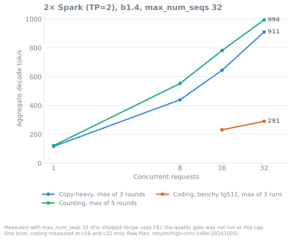

<div align="center">

# Qwen3.8-Flash-Next on two DGX Sparks

NVFP4 Qwen3.8-Flash-Next on vLLM V2 with b12x kernels and 4-token MTP across two GB10s (TP=2 over ConnectX-7), launched
with sparkrun. 262k context, OpenAI-compatible API.<br>
The single-Spark (TP=1) recipe has its own repo: [qwen3.8-flash-next-1x-dgx-spark](https://github.com/ursuciprian/qwen3.8-flash-next-1x-dgx-spark).<br>
A build is promoted only if it passes the [quality gate](#quality-gate) and no c1–c4 cell is slower beyond noise.


</div>

| Workload | Tokens / step | 1 request | 8 requests | 16 requests |
|---|:---:|:---:|:---:|:---:|
| **Copy-heavy** (high acceptance, max of 3 rounds) | 4.90–4.96 | 117 | **439** | |
| **Counting** (high acceptance, max of 5 rounds) | 4.82–5.00 | 122 | **558** | **795** |
| **Coding**, llama-benchy tg512 | 2.7–2.8 | 62 | 196 | 243 |
| **Coding** at 16k cached context | 2.6–2.7 | 64 | 146 | 177 |
| **Prefill**, 2,048-token prompt | | 2,784–2,855 | | |
| **Prefill**, filling a 16k context | | 2,895–2,920 | | |

Aggregate decode tok/s unless marked prefill. Build b1.4. The current build, b1.6 (2026-10-08), adds a retrained MTP
drafter to b1.4; its paired screen is under [b1.6](#2-spark-tp2-build-b16). Workloads, dates and raw files: [Measured](#measured).

<div align="center">

[](#quality-gate)
[](#quality-gate)
[](#quality-gate)
[](#quality-gate)
<br>
[](#changelog)
[](docs/REFERENCE.md#what-is-in-the-image)
[](LICENSE)

</div>

## Quick start

Needs [sparkrun](https://github.com/eugr/sparkrun) ≥ 0.3.6.

```sh
sparkrun registry add https://github.com/ursuciprian/qwen3.8-flash-next-dgx-spark-tp-2
sparkrun run qwen3.8-flash-next-2x-dgx-spark     # default cluster, or --hosts <head>,<worker>
```

> The single-Spark recipe moved to [qwen3.8-flash-next-1x-dgx-spark](https://github.com/ursuciprian/qwen3.8-flash-next-1x-dgx-spark) on 2026-10-08, with its results,
> benchmarks and open issues. This repo still carries a copy of `qwen3.8-flash-next-1x-dgx-spark` and `-previous`
> (unchanged apart from a header comment) so existing `sparkrun run` setups and raw links keep working; new 1× builds
> ship only in the new repo. With both registries added, use `@qwen38-flashnext-1x/qwen3.8-flash-next-1x-dgx-spark`.

Two Sparks can also run one [1× copy](https://github.com/ursuciprian/qwen3.8-flash-next-1x-dgx-spark) each behind a router: [one cluster or one copy per Spark](#two-sparks-one-cluster-or-one-copy-per-spark).

Then [verify](#verify) the server. Base URL `http://<head>:8000/v1`, model `qwen3.8-flash-next`.

[Measured](#measured) · [Quality gate](#quality-gate) · [Verify](#verify) · [Requirements](#requirements) · [Known limits](#known-limits) · [Recipes](#recipes) · [Changelog](#changelog) · [How we measure](#how-we-measure) · [Troubleshooting](#troubleshooting)

## Measured

Workloads are labelled per row, because they differ by about 2× in tokens per decode step:

- High-acceptance workloads (copying, counting) accept nearly every MTP draft (~4.9–5.0 tokens per step). They show
  the decode rate when drafts land, which bounds what MTP can give.
- Coding (llama-benchy) is an agent coding turn at temperature 1.0 with thinking on (2.6–2.8 tokens per step), the
  rate an agent sees.
- Coding (36 prompts) sends 36 short coding requests (12 Python, 8 each C++, Rust and Go) one at a time, up to 768
  tokens out, once at temperature 0 with thinking off and once with the server defaults (thinking on). The cell is
  the median decode tok/s of the 36 requests, with the max in brackets
  ([details](docs/BENCHMARKS.md#coding-probe-36-prompts-in-four-languages-2026-10-06)).

### 2× Spark (TP=2), build b1.6

b1.6 is b1.4 with the retrained MTP drafter of the [1× v3e](https://github.com/ursuciprian/qwen3.8-flash-next-1x-dgx-spark#build-v3e)
([#115](https://github.com/ursuciprian/qwen3.8-flash-next-dgx-spark-tp-2/issues/115)). The main model is unchanged
(`local-inference-lab/Qwen3.8-Flash-Next-NVFP4` @ `7c4f1bc1`); only the drafter's 24 dense BF16 tensors take their
values from `ursuciprian/Qwen3.8-Flash-Next-NVFP4-GDN-MSE` @ `16c9bd54`. The image carries them (178 MB), and on the
first boot each node builds a copy of the 7c4f1bc1 snapshot with the new drafter in the runtime cache (4.5 GB, a few
seconds; sha256 checked). No extra download.

Screen against b1.4 (k71, Thunderdome rules on the pair, b1.4 and b1.6 booted alternately, 2 boots each, T=0 probe
cells plus llama-benchy). Change in tok/s, noise band in brackets; no cell was worse beyond its noise band:

| Cell | b1.6 vs b1.4 |
|---|:---:|
| Acceptance per draft position 1 / 2 / 3 / 4 | 0.819 / 0.670 / 0.546 / 0.445 → 0.855 / 0.712 / 0.592 / 0.492 |
| Fresh, 4 requests | +10.9% (6.5%) |
| Fresh, 8 requests | +6.2% (3.5%) |
| 16K context, 8 requests, wall time | +1.7% (1.1%) |
| llama-benchy tg512, 8 requests | +7.2% (4.8%), 181.1 → 194.0 t/s |
| llama-benchy tg512, 1 request | +1.1% (15.0%), 72.9 → 73.7 t/s |
| llama-benchy pp2048, 1 request | +3.5% (4.1%) |
| Fresh 1 request, 16K 4 requests, counting 8 requests | +3.4%, +3.5%, +0.7%, all inside noise |

The gate passed (see [Quality gate](#quality-gate)); Jev ship verdict 0.88. A check boot of the published image with
plain `sparkrun run` came up in 221 s, measured 0 b12x plans and gave tg512 79.1 t/s at c1 and 186.7 at c8. Details and
raw files: [docs/BENCHMARKS.md](docs/BENCHMARKS.md#b16-image-retrained-mtp-drafter-on-2-spark-2026-10-08).

The tables below are b1.4's full benchmark runs; b1.6 has not been re-run on that set.

### 2× Spark (TP=2), build b1.4

| Workload | Tokens/step | c1 | c4 | c8 | c16 | Build |
|---|:---:|:---:|:---:|:---:|:---:|---|
| **High-acceptance:** copy-heavy, max of 3 rounds | 4.91–4.95 | 117.2 | 290.1 | 439.4 | | b1.4 (2026-10-04) |
| **High-acceptance:** counting, T=0, max of 5 rounds | 4.91–5.00 | 122.4 | 389.8 | 558.0 | 795.3 | b1.4 (2026-10-05) |
| **Coding:** llama-benchy tg512, depth 0 | 2.7–2.8 | 62.2 | 150.9 | 195.5 | 242.8 | b1.4 (2026-10-01) |
| **Coding:** llama-benchy tg512, 16k cached depth | 2.6–2.7 | 63.8 | 117.5 | 145.9 | 176.5 | b1.4 (2026-10-01) |
| **Coding:** 36 prompts, T=0, thinking off, median (max) | 4.01 | 106.2 (120.6) | | | | b1.4 (2026-10-06) |
| **Coding:** 36 prompts, server defaults (thinking on), median (max) | 3.44 | 87.5 (97.2) | | | | b1.4 (2026-10-06) |

Prefill (c1): 2,784–2,855 tok/s for a 2,048-token prompt; 2,895–2,920 tok/s filling a 16k context (two boots).
TTFT at c1: 0.75 s (2k new tokens) / 1.70 s (2k new tokens on a 16k cached context). c2/c5/c10 cells:
[docs/BENCHMARKS.md](docs/BENCHMARKS.md#b14-image-2026-10-01).

KV pool (fp8 KV, `gpu_memory_utilization` 0.80, boot of 2026-10-02): 30.53 GiB, 3,673,158 tokens, which vLLM reports
as 14.01x concurrency at 262,144 tokens per request. vLLM sizes the pool by profiling memory at boot, so it varies a
little: other 2× boots of the b1.x builds logged 3.57M to 3.69M tokens, and the `max_num_seqs` 32 boot logged
3,615,479 (13.79x). This is vLLM's capacity figure; 14 concurrent 262K requests have not been run. Serve-log lines:
[`kv-pool-2x.txt`](results/b1.4-20261001/kv-pool-2x.txt).


### Decode at 0 / 16K / 64K context (llm-inference-bench)

30 s of sustained decode per cell at c1/c4/c8, with 0, 16K or 64K tokens already in each prompt, server default
sampling, thinking on; one boot (2026-10-05). Aggregate tok/s:

| Setup | c1 (0 / 16K / 64K) | c4 (0 / 16K / 64K) | c8 (0 / 16K / 64K) | Tokens/step |
|---|:---:|:---:|:---:|:---:|
| 2× Spark, b1.4 | 64.8 / 73.3 / 77.8 | 171.2 / 175.0 / 165.4 | 248.6 / 254.9 / 257.4 | 2.7–3.1 |


Same runs, other checks:

- Standalone prefill of an 8K prompt: 2,857 tok/s.
- The 8-run hotel-lights check in this benchmark run (default effort) gave 8/8. The single-Spark comparison of
  `medium` against `xhigh` on that check is in the [1× repo](https://github.com/ursuciprian/qwen3.8-flash-next-1x-dgx-spark#decode-at-0--16k--64k-context-llm-inference-bench).

Raw files: [`results/lib-bench-20261005/`](results/lib-bench-20261005/).

Conditions. Coding rows: [llama-benchy](https://github.com/ursuciprian/llama-benchy) `--prompt-mode task`, 2,048 new
prompt tokens, up to 512 out, thinking on, T=1.0 / top-p 0.95 / top-k 20, prefix caching on; mean of two boots × 3 runs. Counting: "list the numbers from 1 to 300", T=0, thinking off, 5 rounds
per concurrency level with every round saved; the tables show the max round (median of 5 rounds: 119.5 / 350.0 /
544.1 / 787.3 at c1/c4/c8/c16). Copy-heavy benchmark: 1–8 concurrent copy
tasks from a shared cached prefix at low reasoning effort, 1,500 tokens out, 3 rounds per task count; tok/s is counted
over the window where all tasks decode, and the tables show the max of the 3 rounds (2026-10-04). Tokens/step is 1 + 4 × accepted/draft tokens from vLLM's spec-decode counters (benchy `accept/draft`
column, `tokens_per_step` in the copy-heavy and counting files). Raw files:
[`results/b1.4-20261001/`](results/b1.4-20261001/) ([`b14.json`](results/b1.4-20261001/b14.json), [`benchy/`](results/b1.4-20261001/benchy/)),
2× counting [`results/lib-bench-20261005/tp2-b1.4/`](results/lib-bench-20261005/tp2-b1.4/), 2× copy-heavy
[`results/showcase-20261004/A/`](results/showcase-20261004/A/).
Charts: `uv run scripts/make_charts.py` renders every chart on this page from those files.

### High concurrency: measured with max_num_seqs 32, quality gate not run at this cap

The shipped recipe caps concurrency at 16 requests. These runs raised `max_num_seqs` to 32 to show
how far aggregate throughput goes. The quality gate has not been run at this cap, so these are throughput
measurements only, not a supported configuration. One fresh boot (2026-10-05); the 1× v3d run of the same day is in
the [1× repo](https://github.com/ursuciprian/qwen3.8-flash-next-1x-dgx-spark#high-concurrency-measured-with-max_num_seqs-32-quality-gate-not-run-at-this-cap).



| Workload | c16 | c32 |
|---|:---:|:---:|
| Counting, max of 5 rounds | 781.9 | **994.4** |
| Copy-heavy, max of 3 rounds (streams) | 644.9 | **910.7** |
| Coding, llama-benchy tg512, max of 3 runs | 232.0 | **290.7** |

- Straggler probe at c8/c16/c32: 0 preemptions, 3.98–3.99 accepted per 4 drafts.
- Per-request speed drops as requests are added. At c32 counting runs at 32.0 tok/s per request, and the TTFT probe
  (~1.5K-token prompts) reached 14.5 s at p50.
- Lowest MemAvailable 5.2 / 6.6 GiB (dgx-01 / dgx-02).

Full tables: [docs/BENCHMARKS.md](docs/BENCHMARKS.md#high-concurrency-max_num_seqs-32-2026-10-05), raw files:
[`results/high-conc-k46b-20261005/`](results/high-conc-k46b-20261005/).

### Several long contexts at once, 2× b1.4

The quality gate runs the long-context tool-call probe one request at a time. On 2026-10-07 the shipped 2× recipe ran
it with up to four requests at once (thinking on, temperature 0.6, one boot). "Same transcript" rows send N requests
on one prompt (prefix cache warm); "different transcripts" rows run N probes with their own prompts, all starting cold.

| Prompt tokens | Requests at once | Exact tool calls | TTFT mean / max (s) | Decode tok/s per request | KV max |
|---|---|:---:|:---:|:---:|:---:|
| 245,267 | 1 | 20/20 | 8.0 / 124.1 | 95.9 | 7% |
| 245,267 | 4, same transcript | 20/20 | 3.5 / 6.1 | 31.4 | 10% |
| 244,407 | 4, different transcripts | 40/40 | 40.9 / 511.7 | 30.9 | 27% |
| 256,515 | 1 | 20/20 | 8.3 / 131.8 | 89.3 | 7% |
| 256,515 | 4, same transcript | 20/20 | 3.1 / 5.8 | 33.5 | 10% |
| 256,024 | 4, different transcripts | 40/40 | 42.8 / 540.4 | 34.7 | 28% |

All 10 runs (these plus 2 at once): 240 of 240 exact, 0 preemptions, lowest MemAvailable 10.51 GiB. The TTFT max is
the cold prefill: about 2 minutes for one ~250K prompt, and with four different cold contexts the last one waits for
the other three. More than four ~256K contexts at once was not run. Full table:
[docs/BENCHMARKS.md](docs/BENCHMARKS.md#long-contexts-at-once-on-2-b14-2026-10-07), raw files:
[`results/longctx-concurrency-k59-20261007-0206/`](results/longctx-concurrency-k59-20261007-0206/).

### Two Sparks: one cluster or one copy per Spark

Two Sparks can run the 2× recipe as one TP=2 server, or the [1× recipe](https://github.com/ursuciprian/qwen3.8-flash-next-1x-dgx-spark) once per Spark (DP=2) behind a small router,
[`tools/dp2/pa_router.py`](tools/dp2/pa_router.py). The router sends a new conversation to the replica with the fewest
conversations and keeps every later turn on that replica, so each turn hits its prefix cache.
How-to, flags and limits: [tools/dp2/README.md](tools/dp2/README.md).

k72, 2026-10-08: the shipped 2× b1.6 against the shipped 1× v3e on each Spark behind the router, the same synthetic
agent replay on both (tools on, thinking off, temperature 0.6, all sessions starting together), one boot each.

| Workload | Wall time, TP=2 / DP=2 (s) | Output tok/s total, TP=2 / DP=2 | First-turn TTFT mean, TP=2 / DP=2 (s) | Follow-up TTFT mean, TP=2 / DP=2 (s) |
|---|:---:|:---:|:---:|:---:|
| 8 sessions x 6 turns from ~32K tokens | 157.1 / 111.6 | 12.2 / 20.5 | 64.9 / 49.5 | 5.0 / 4.5 |
| 16 sessions x 4 turns from ~32K tokens | 255.6 / 173.3 | 10.3 / 14.3 | 123.8 / 88.1 | 9.4 / 8.7 |
| 4 sessions x 2 turns from ~128K tokens | 225.7 / 141.9 | 1.3 / 2.3 | 166.3 / 136.6 | 5.6 / 2.4 |
| 8 sessions x 2 turns from ~128K tokens | 452.5 / 284.6 | 1.3 / 2.4 | 285.8 / 210.8 | 8.4 / 6.0 |
| 12 sessions x 2 turns from ~128K tokens | 680.2 / 428.4 | 1.2 / 2.1 | 411.0 / 284.0 | 32.5 / 7.3 |
| 16 sessions x 2 turns from ~128K tokens | 901.7 / 567.8 | 1.2 / 2.0 | 519.4 / 360.7 | 63.4 / 8.1 |

- DP=2 finished every workload 29–37% sooner. Output length differs between the setups (from 6% fewer to 19% more
  tokens on DP=2), so wall time is the fairer column; it points the same way on all six.
- The router split every workload evenly (4/4 sessions at 8, 8/8 at 16). 0 preemptions on both setups, and both ran
  16 sessions of ~129,500 tokens, the largest step tested.
- Quality through the router passed the full gate: hardmode 93, TC-45 100, tool-call retrieval 20/20 at 8k, 32k, 64k
  and three ~245k prompts, and no batch stragglers on either replica (c5 to c16, 0 preemptions).
- KV: each 1× replica has its own pool of 993,754 tokens; the TP=2 server has one pool of 3,650,419 tokens.

When to pick which:

- DP=2 for many concurrent sessions or agents whose live contexts fit each Spark's 993,754-token pool: more
  throughput and lower TTFT in every workload above.
- TP=2 for one request at a time, where it decodes faster (see [2× Spark](#2-spark-tp2-build-b16) against
  [1× Spark](https://github.com/ursuciprian/qwen3.8-flash-next-1x-dgx-spark#measured)), and for many very long contexts at once: a single 1× replica
  fits about 3.8 requests at 262,144 tokens, the TP=2 pool about 14.
- DP=2 has no failover in the router: if one Spark goes down, its conversations fail until it is back.

Full table (decode tok/s per request, prefix hits, KV usage and sessions per replica, MemAvailable), the earlier k60
and k63 runs, and raw files: [docs/BENCHMARKS.md](docs/BENCHMARKS.md#dp2-against-2-tp2-production-gate-2026-10-08),
[`results/dp2-gate-k72-20261008-1135/`](results/dp2-gate-k72-20261008-1135/).

## Quality gate

A build ships only if it passes every check.


| Check | Tool | 2× Spark b1.4 |
|---|---|:---:|
| Hard multi-step tool use (88 scenarios, thinking on, T=0); gate ≥ 88 | [tool-eval-bench](https://github.com/SeraphimSerapis) `--hardmode` | 92/100 on both A/B boots (run-to-run band 86–93) |
| `tool_choice=required` compliance, 5 trials | TC-45 | 100/100 |
| Long-context tool-call retrieval, 20 needles per depth; actual prompt sizes ~15.7k / 61.7k / 122.6k / 245k tokens | [`scripts/fidelity_probe.py`](scripts/fidelity_probe.py) | 20/20 at every depth (re-gate boot¹); 32k seeds 21, 22 and ~245k seeds 11, 13: 20/20 |
| Batch stragglers | [`scripts/straggler_probe.py`](scripts/straggler_probe.py) | none, c5–c16 |
| Numerics vs previous build (20 prompts × 16 tokens, top-5 logprobs) | [`scripts/logits_equiv.py`](scripts/logits_equiv.py) | mean \|Δlogprob\| 0.033–0.041 vs self-noise 0.038–0.046 |
| MTP acceptance per draft position (numerics canary) | paired decode probe | within ±0.03 of b1.3 |
| Host memory headroom during the gate | `MemAvailable` | not recorded |
| DevOps task set (14 prompts × 3, graded by terraform / kubeconform / actionlint / shellcheck / helm / hadolint / promtool) | own grader | 95.9% checks, 29/42 clean, 0/42 runaway thinking |

2× b1.6 (k71, one TP=2 boot): hardmode 92/100, TC-45 100/100, retrieval 20/20 at every depth and at two more ~245k
seeds, stragglers none at c8–c16 with 0 preemptions. Images also pass a seed check before they ship: a first boot
must log 0 measured b12x plans ([`scripts/check_seed.py`](scripts/check_seed.py)), because a seed that lacks plans
makes a fresh install tune them on its own and serve other kernels than the ones measured (k70).

¹ The A/B boot had one `no_call` at 32k (19/20). Twenty cold 32k trials per build then gave 20/20 for both b1.3 and
b1.4, and a fresh re-gate boot passed. Details: [docs/BENCHMARKS.md](docs/BENCHMARKS.md#quality-b14).

Depth labels in the gate logs are 8k / 32k / 64k / 128k; the probe sizes transcripts by characters, and the logged
actual prompt sizes are the token counts in the table above.

Not yet measured at the `medium` thinking default: MMLU-Pro, GSM8K, IFEval, LiveCodeBench.

## Verify

`sparkrun run` returns before the engine is ready. Wait for health, then check that the reply has both reasoning and
an answer:

```sh
H=http://<head>:8000
until [ "$(curl -s -o /dev/null -w '%{http_code}' $H/health)" = 200 ]; do sleep 10; done
curl -s $H/v1/chat/completions -H 'Content-Type: application/json' -d '{
  "model":"qwen3.8-flash-next","max_tokens":1024,
  "messages":[{"role":"user","content":"Write a Python function that reverses a string."}]}' \
| python3 -c "import json,sys; m=json.load(sys.stdin)['choices'][0]['message']
print('reasoning:', len(m.get('reasoning') or m.get('reasoning_content') or ''), 'chars')
print('content  :', (m.get('content') or '')[:300])"
```

Empty `content` with long reasoning means `max_tokens` ran out inside thinking; garbled text means a checkpoint
mismatch (see [Troubleshooting](#troubleshooting)).

Optional long-context check (stdlib Python), expect `exact 20` at both depths.

```sh
git clone https://github.com/ursuciprian/qwen3.8-flash-next-dgx-spark-tp-2 && cd qwen3.8-flash-next-dgx-spark-tp-2
python3 scripts/fidelity_probe.py --base $H --model qwen3.8-flash-next --depths 8000,32000
```

The server binds 0.0.0.0 with no API key: keep it on a trusted network or put a proxy with auth in front.
Stop with `sparkrun stop --all`.
<!-- TODO: document --api-key through sparkrun. -->

> To upgrade, note that sparkrun caches registries and does not refresh them on `run`. Run `sparkrun registry update qwen38-flashnext`
> first, or the previous recipe revision boots.

## Requirements

| | |
|---|---|
| **Hardware** | 2× DGX Spark (GB10, 128 GB unified), CX-7 ports cabled back-to-back |
| **Launcher** | sparkrun ≥ 0.3.6 with a two-node cluster defined |
| **Disk** | ~130 GB per node (98.5 GiB checkpoint + ~25 GB image + 4.5 GB drafter copy in the runtime cache) |
| **Kernel** | `6.17.0-1032-nvidia`. `7.0.0-1019-nvidia` breaks NCCL `ibv_reg_mr` past ~85 GB GPU-resident ([forum](https://forums.developer.nvidia.com/t/dgx-spark-regression-kernel-7-0-0-1019-nvidia-causes-nccl-roce-ibv-reg-mr-iova2-enomem-6-17-0-1032-works/383023)) |
| **Host setting** | `loginctl enable-linger nvidia` on both nodes (otherwise logind `RemoveIPC` kills the shm ring buffer) |
| **Boot** | ~4 min warm, ~9.5 min cold |
| **Concurrency** | `max_num_seqs` 16, KV pool 30.53 GiB (3,673,158 tokens, 14.01x at 262,144; varies by boot, see [Measured](#2-spark-tp2-build-b14)) |

Checkpoint: [`local-inference-lab/Qwen3.8-Flash-Next-NVFP4`](https://huggingface.co/local-inference-lab/Qwen3.8-Flash-Next-NVFP4)
@ `7c4f1bc1`. NVFP4 experts; MXFP8 dense, GDN and attention; 98.5 GiB. b1.6 also carries the 24 retrained drafter
tensors of [`ursuciprian/Qwen3.8-Flash-Next-NVFP4-GDN-MSE`](https://huggingface.co/ursuciprian/Qwen3.8-Flash-Next-NVFP4-GDN-MSE)
@ `16c9bd54` in its image (no extra download).

Image and video input are not tested on these builds.

## Known limits

- By vLLM's count the KV pool fits about 14 requests at 262,144 tokens (3,673,158 tokens on the
  2026-10-02 boot), under the 16-request cap. Four different ~256K contexts at once used 28% of the pool
  ([measured](#several-long-contexts-at-once-2-b14)); more than four at once have not been run.
- b1.6 serves a copy of the 7c4f1bc1 snapshot at a fixed path in sparkrun's runtime cache, and its plan
  seed is keyed to that path. Deleting `~/.cache/sparkrun/runtime-cache` only costs a rebuild of the copy on the next
  boot; deleting the HF cache needs the 7c4f1bc1 download again, as before.
- c1 varies between boots (earlier builds showed two levels, ~95–100 and ~85–88 tok/s on counting); the counting tables show the max of 5 rounds from one boot.
- Hardmode still fails a few multi-step scenarios (e.g. TC-30, TC-68, TC-74, TC-88) on every build.
- Prose throughput was not re-measured on b1.4.

## Recipes

| Recipe | Image | Use |
|---|---|---|
| [`qwen3.8-flash-next-2x-dgx-spark`](recipes/qwen3.8-flash-next/qwen3.8-flash-next-2x-dgx-spark.yaml) | `b1.6-20261008-b7fbaf96-a7e649d8-warm` | 2× Spark default, b1.6 (retrained drafter) |
| [`qwen3.8-flash-next-2x-dgx-spark-previous`](recipes/qwen3.8-flash-next/qwen3.8-flash-next-2x-dgx-spark-previous.yaml) | `b1.4-20261001-b7fbaf96-a7e649d8-warm` | Rollback: b1.4, original drafter |
| `qwen3.8-flash-next-1x-dgx-spark`, `-previous` | v3e / v3d | Compatibility copies of the single-Spark recipes, which now live in [qwen3.8-flash-next-1x-dgx-spark](https://github.com/ursuciprian/qwen3.8-flash-next-1x-dgx-spark) |

The pair shares the runtime cache, so a rollback boots warm. Renames: [recipes/RENAMES.md](recipes/RENAMES.md).

## Changelog

Promoted builds only. Deltas are from that build's own A/B against the previous one; paired-probe figures are decode
step time at T=0 with 95% CIs. Every row passed the gate.


Same checkpoint throughout.

| Build | Date | Coding c1 d0 | Coding c16 16k | TTFT c1 16k | What changed | Measured delta |
|---|---|:---:|:---:|:---:|---|---|
| b1 | 2026-09-25 | 54 | 139 | 2.6 s | Deferred GDN checkpoints, TC-45 fix | d0 c8 186.6 vs 166.8, c16 241.1 vs 218.6 |
| b1.1 | 2026-09-26 | 53.4 | 175.9 | - | Exact prefix hits under MTP, `NULL_BLOCK_ID` padding fix, compile-worker cap | 16k c16 176.5 vs 139.4; cached-prefix TTFT 16k −37% |
| b1.2 | 2026-09-27 | 58.2–61.8 | 173.3–176.1 | - | HC mixers in online MXFP8 | step −9.9% c1 fresh, −4.4 to −7.6% c2–c4 |
| b1.3 | 2026-09-29 | 62.2 | 178.5 | 1.71 s | GDN uniform-decode metadata skip (~350 launches/step) | step −1.9 to −3.1% c1, −2.5 to −3.0% c2 |
| b1.4 | 2026-10-01 | 62.2 | 176.4 | 1.70 s | 131k-id MTP draft vocab, QSA race + recompile fixes, thinking effort `medium` | step −2 to −5% c1–c8; d0 c5 +4.2%; counting c1 +4.9% |
| **b1.6** | **2026-10-08** | **73.7²** | **-** | **-** | Retrained MTP drafter (v3e's), plan seed with all 616 plans | acceptance +0.036 to +0.047 per position; tg512 c8 +7.2%, fresh c4 +10.9%, fresh c8 +6.2%; c1 within noise |

² From b1.6's own A/B (k71), where b1.4 measured 72.9 the same day; earlier rows come from their builds' A/Bs. b1.5
(GDN-MSE main weights at TP=2) failed the 128k fidelity gate and was not shipped.

The single-Spark builds (v2 to v3e) have their own changelog in the [1× repo](https://github.com/ursuciprian/qwen3.8-flash-next-1x-dgx-spark#changelog).

## How we measure

- The coding grid runs llama-benchy task mode (above) at c1–c16 and depths 0 / 16k, 3 runs per boot, two boots per build. A cell counts as changed only if the difference is larger than its own boot-to-boot noise.
- The paired A/B runs the candidate and the previous build on the same prompts at temperature 0, booted in ABBA order, two boots per build. We report decode step time, tokens per step and tok/s per cell with 95% CIs.
  <!-- TODO: commit the script that produces these reports. -->
- To be promoted, a build must pass the gate; at least one coding or counting cell must be faster beyond noise; no c1–c4
  cell may be slower beyond noise, and a loss at c5–c16 is published as a caveat ([`scripts/arm_verdict.py`](scripts/arm_verdict.py)).
- MTP acceptance per draft position is compared cell by cell as a numerics canary. A drop means the target or draft
  numerics changed, even when the gate passes. Logprob agreement against the previous build must sit within self-noise.
- High-acceptance rows (counting, copy-heavy) give an upper bound for MTP decode; the coding rows give agent speed.

Index of every run and verdict: [results/README.md](results/README.md).

## How it works

- TP=2 over RoCE, one rank per GB10; all-reduces over the CX-7 link take ~4% of a c1 decode step.
- b12x kernels cover NVFP4 MoE, MXFP8 linears, GDN (36 layers) and QSA sparse attention (12 layers), with an
  autotuned plan cache baked into each image.
- MTP ×4 uses probabilistic drafts over a 131k-id draft vocabulary; rejection sampling keeps the output distribution
  unchanged.
- The c1 step (~43 ms) splits into MoE 30%, dense MXFP8 31%, MTP draft + head 19%, idle 6%,
  all-reduce 4%, GDN 3%. MoE reads ~175 GB/s of the ~250 GB/s the GB10 reaches.

Flags, environment variables and the reason for each: [docs/REFERENCE.md](docs/REFERENCE.md). Kernel and engine notes,
rejected experiments: [docs/ENGINEERING.md](docs/ENGINEERING.md).

## Thinking effort

The recipes set the server default to `reasoning_effort: medium`. On my DevOps task set, b1.2 at the
template default `xhigh` passed 42.5% of checks with 23/42 runaway-thinking runs and a 246 s median per task; b1.4 at
`medium` passed 95.9% with 0/42 runaway and 33 s. A request can still ask for `xhigh` or `low`; `"reasoning_effort": "none"`
turns thinking off. Override table and measurements: [docs/REFERENCE.md](docs/REFERENCE.md#thinking-effort).
For hard reasoning problems `xhigh` per request helps: on the hotel-lights check, the single-Spark v3c went from 21/32 at
`medium` to 31/31 completed runs ([#88](https://github.com/ursuciprian/qwen3.8-flash-next-dgx-spark-tp-2/issues/88)). Allow a long client timeout, since most
of those answers took over 30 minutes at 8 concurrent requests.

## Troubleshooting

| Symptom | Fix |
|---|---|
| `/health` silent for minutes | Expected on a cold boot. `sparkrun logs <recipe> -f` |
| OOM / earlyoom at start | Unified memory: `gpu_memory_utilization` ≥ 0.84 starves host RAM. Keep 0.80 and clear other containers |
| NCCL `ibv_reg_mr_iova2 ... Cannot allocate memory` | Kernel `7.0.0-1019-nvidia`; hold `6.17.0-1032-nvidia` |
| `ShmRingBuffer ... shared_memory` crash | `loginctl enable-linger nvidia` on both nodes |
| Garbled output | Rank checkpoint mismatch: both serve logs must show `snapshots/7c4f1bc1` ([why](docs/REFERENCE.md#tuning-and-troubleshooting)) |
| Empty `content`, long reasoning | `max_tokens` ran out during thinking; raise it or send `"reasoning_effort": "low"` |
| Old build boots after an upgrade | `sparkrun registry update qwen38-flashnext` |
| Anything else | Try the `-previous` recipe, then open an issue with `sparkrun logs <recipe> -a` |

## Docs

| | |
|---|---|
| [docs/REFERENCE.md](docs/REFERENCE.md) | Configuration, image provenance, thinking effort, tuning, known limits |
| [docs/BENCHMARKS.md](docs/BENCHMARKS.md) | Full benchmark and quality tables for every build |
| [docs/ENGINEERING.md](docs/ENGINEERING.md) | Known issues and fixes, profiling, rejected experiments |
| [results/](results/README.md) | Every raw measurement and verdict |
| [archive/](archive/recipes/README.md) | Experimental and superseded recipes (not listed by sparkrun) |
| [qwen3.8-flash-next-1x-dgx-spark](https://github.com/ursuciprian/qwen3.8-flash-next-1x-dgx-spark) | The single-Spark (TP=1) recipe, its builds, results and issues |

## Credits

This build stands on these projects:

- [local-inference-lab](https://github.com/local-inference-lab): the vLLM fork our branches start from, the b12x kernels (NVFP4 MoE, GDN, QSA) and the NVFP4 checkpoint (the 1× checkpoint is derived from it).
- [Qwen](https://huggingface.co/Qwen/Qwen3.8-Flash-Next): the base model, under the Qwen Community License 1.0.
- [eugr](https://github.com/eugr): spark-vllm-docker (our image base), sparkrun (the launcher), and llama-benchy (the base of our benchmark fork).
- [tonyd2wild](https://github.com/tonyd2wild): the bench_sweep counting harness behind the counting numbers.
- [SeraphimSerapis](https://github.com/SeraphimSerapis): tool-eval-bench, which runs the hardmode and TC-45 quality gate.

Earlier experiments drew on other projects too, and [docs/ENGINEERING.md](docs/ENGINEERING.md#credits) keeps that full history with exact pins.

## License

Apache-2.0, see [`LICENSE`](LICENSE). The vLLM overlays under `archive/mods/` keep their upstream Apache-2.0 headers.
Model weights are not part of this repo and keep their own license (Qwen Community License 1.0; see each checkpoint's model card).
