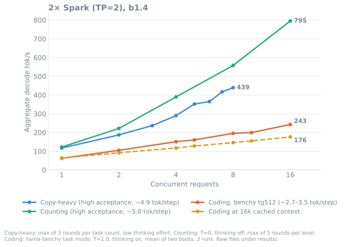
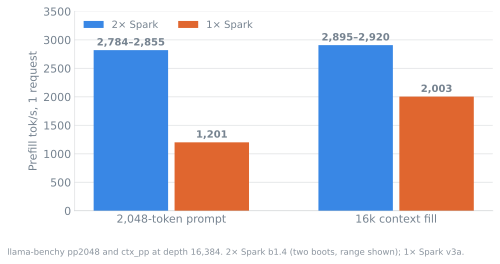
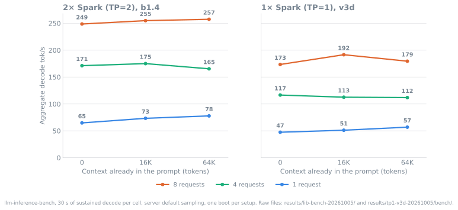
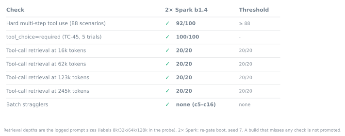
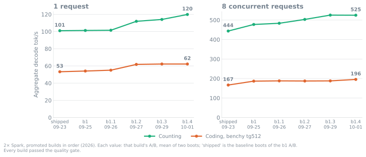

<div align="center">

# Qwen3.8-Flash-Next on DGX Spark: one or two GB10s

NVFP4 Qwen3.8-Flash-Next on vLLM V2 with b12x kernels and 4-token MTP, launched with sparkrun. 262k context, OpenAI-compatible API.<br>
Two recipes: **2× Spark** (TP=2 over ConnectX-7) and **1× Spark** (TP=1, experimental, NVFP4 GDN weights).<br>
A build is promoted only if it passes the [quality gate](#quality-gate) and no c1–c4 cell is slower beyond noise.



</div>

| Workload | Tokens / step | 2× Spark, 1 request | 2× Spark, 8 requests | 1× Spark, 1 request | 1× Spark, 8 requests |
|---|:---:|:---:|:---:|:---:|:---:|
| **Copy-heavy** (high acceptance, max of 3 rounds) | 4.90–4.96 | 117 | **439** | 81 | **282** |
| **Counting** (high acceptance, max of 5 rounds) | 4.82–5.00 | 122 | **558** | 85 | **378** |
| **Coding**, llama-benchy tg512 | 2.7–2.8 (2×) · 3.3–3.5 (1×) | 62 | 196 | 60 | 139 |
| **Coding** at 16k cached context | 2.6–2.7 (2×) · 3.1–3.4 (1×) | 64 | 146 | 63 | 111 |
| **Prefill**, 2,048-token prompt | | 2,784–2,855 | | 1,788 | |
| **Prefill**, filling a 16k context | | 2,895–2,920 | | 2,088 | |

Aggregate decode tok/s unless marked prefill. Builds: 2× Spark b1.4; 1× Spark v3d (2026-10-05). Workloads, dates
and raw files: [Measured](#measured).

<div align="center">

[](#quality-gate)
[](#quality-gate)
[](#quality-gate)
[](#quality-gate)
<br>
[](#changelog)
[](#changelog)
[](docs/REFERENCE.md#what-is-in-the-image)
[](LICENSE)

</div>

## Quick start

Needs [sparkrun](https://github.com/eugr/sparkrun) ≥ 0.3.6.

```sh
sparkrun registry add https://github.com/ursuciprian/qwen3.8-flash-next-dgx-spark-tp-2
sparkrun run qwen3.8-flash-next-2x-dgx-spark                     # 2× Spark: default cluster, or --hosts <head>,<worker>
sparkrun run qwen3.8-flash-next-1x-dgx-spark --hosts <spark> --solo   # 1× Spark
```

Then [verify](#verify) the server. Base URL `http://<head>:8000/v1`, model `qwen3.8-flash-next`.

[Measured](#measured) · [Quality gate](#quality-gate) · [Verify](#verify) · [Requirements](#requirements) · [Known limits](#known-limits) · [Recipes](#recipes) · [Changelog](#changelog) · [How we measure](#how-we-measure) · [Troubleshooting](#troubleshooting)

## Measured

Two kinds of workload, labelled per row, because they differ by about 2× in tokens per decode step:

- High-acceptance workloads (copying, counting) accept nearly every MTP draft (~4.9–5.0 tokens per step). They show
  the decode rate when drafts land, which bounds what MTP can give.
- Coding is an agent coding turn at temperature 1.0 with thinking on (2.6–3.4 tokens per step), the rate an agent sees.

### 2× Spark (TP=2), build b1.4

| Workload | Tokens/step | c1 | c4 | c8 | c16 | Build |
|---|:---:|:---:|:---:|:---:|:---:|---|
| **High-acceptance:** copy-heavy, max of 3 rounds | 4.91–4.95 | 117.2 | 290.1 | 439.4 | | b1.4 (2026-10-04) |
| **High-acceptance:** counting, T=0, max of 5 rounds | 4.91–5.00 | 122.4 | 389.8 | 558.0 | 795.3 | b1.4 (2026-10-05) |
| **Coding:** llama-benchy tg512, depth 0 | 2.7–2.8 | 62.2 | 150.9 | 195.5 | 242.8 | b1.4 (2026-10-01) |
| **Coding:** llama-benchy tg512, 16k cached depth | 2.6–2.7 | 63.8 | 117.5 | 145.9 | 176.5 | b1.4 (2026-10-01) |

Prefill (c1): 2,784–2,855 tok/s for a 2,048-token prompt; 2,895–2,920 tok/s filling a 16k context (two boots).
TTFT at c1: 0.75 s (2k new tokens) / 1.70 s (2k new tokens on a 16k cached context). c2/c5/c10 cells:
[docs/BENCHMARKS.md](docs/BENCHMARKS.md#b14-image-2026-10-01).

### 1× Spark (TP=1, experimental), build v3d

| Workload | Tokens/step | c1 | c4 | c8 | Build |
|---|:---:|:---:|:---:|:---:|---|
| **High-acceptance:** copy-heavy, max of 3 rounds | 4.90–4.96 | 80.8 | 188.5 | 281.5 | v3d (2026-10-05) |
| **High-acceptance:** counting, T=0, max of 5 rounds | 4.82–5.00 | 84.8 | 239.8 | 377.8 | v3d (2026-10-05) |
| **Coding:** llama-benchy tg512, depth 0 | 3.3–3.5 | 59.8 | 111.4 | 139.5 | v3d (2026-10-05) |
| **Coding:** llama-benchy tg512, 16k cached depth | 3.1–3.4 | 62.6 | 101.4 | 111.0 | v3d (2026-10-05) |

v3d serves [`ursuciprian/Qwen3.8-Flash-Next-NVFP4-GDN-MSE`](https://huggingface.co/ursuciprian/Qwen3.8-Flash-Next-NVFP4-GDN-MSE):

- This is the NVFP4 checkpoint with its 36 GDN layers' projection weights requantized to weight-only NVFP4. Every other
  tensor is unchanged.
- Decode steps (at most 40 rows) read the NVFP4 weights, about half the bytes of MXFP8.
- Calls of 41 or more rows (prefill) use an MXFP8 copy of the same weights, taken from the base checkpoint.

In the paired screen against v3c (same Spark, T=0), counting c8 was +7.8%, 16K c4 +5.9%, fresh c8 +4.4% and tg512 c1
50.0 → 59.7 tok/s. pp2048 c1 was −0.9% (noise 1.0%), and every other cell was within noise
([report](results/tp1-v3d-20261005/screen-v3d-c41-vs-v3c.txt)). Single cells of the coding grid vary by up to ~10%
between runs.

Prefill (c1): 1,788 tok/s for a 2,048-token prompt; 2,088 tok/s filling a 16k context. TTFT at c1: 1.18 s (2k new
tokens) / 1.94 s (2k new tokens on a 16k cached context).

| Context length | Requests that fit in the KV pool at once, v3b (6 GiB) | v3c / v3d (14 GiB) |
|---|:---:|:---:|
| 16K + 512 out | 7.4 | 39.7 |
| 64K + 512 out | 4.2 | 14.1 |
| 128K + 512 out | 2.6 | 7.5 |

Per 3,024 tokens of context a request takes one KV page in each of 13 attention groups, plus 37 GDN state pages
(185 before compact records); method and serve-log token counts: [`kv-capacity.txt`](results/tp1-v3c-20261005/kv-capacity.txt). `max_num_seqs` is 8, so v3c and v3d run 8 requests at 16K and 64K without
waiting.



### Decode at 0 / 16K / 64K context (llm-inference-bench)

30 s of sustained decode per cell at c1/c4/c8, with 0, 16K or 64K tokens already in each prompt, server default
sampling, thinking on; one boot per setup (2026-10-05). Aggregate tok/s:

| Setup | c1 (0 / 16K / 64K) | c4 (0 / 16K / 64K) | c8 (0 / 16K / 64K) | Tokens/step |
|---|:---:|:---:|:---:|:---:|
| 2× Spark, b1.4 | 64.8 / 73.3 / 77.8 | 171.2 / 175.0 / 165.4 | 248.6 / 254.9 / 257.4 | 2.7–3.1 |
| 1× Spark, v3d | 47.4 / 51.2 / 56.9 | 116.6 / 112.6 / 111.8 | 173.4 / 191.5 / 179.5 | 2.6–3.5 |
| 1× Spark, v3c | 43.7 / 43.0 / 43.3 | 106.2 / 116.9 / 113.9 | 165.7 / 165.6 / 160.4 | 2.7–3.3 |
| 1× Spark, v3b (6 GiB pool) | 46.9 / 45.3 / 44.3 | 116.5 / 112.0 / 106.3 | 168.4 / 174.8 / did not fit | 2.8–3.3 |



Same runs, other checks:

- Standalone prefill of an 8K prompt: 2,857 tok/s on 2×, 2,137 tok/s on 1× v3d. v3d gave 2,182 / 2,147 / 2,066 /
  1,880 at 16K / 32K / 64K / 128K, within 1% of v3c.
- Hotel-lights reasoning check, 32 runs per recipe at c8 on the 1× recipes: v3c 21/32 (66%), v3b 23/32 (72%). The
  difference is not significant (Fisher exact p = 0.79; [#87](https://github.com/ursuciprian/qwen3.8-flash-next-dgx-spark-tp-2/issues/87)).
  - Every run finished on its own stop token. The unscored runs are long answers whose final number the scorer could
    not read, not truncations.
  - Both recipes miss about 1 in 4, mostly by answering 49 or 47 instead of 48.
  - The 8-run checks in these benchmark runs gave 8/8 on 2× b1.4 and 6/8 on 1× v3d.
- Accepted tokens per step vary with the sampled text, so compare decode tok/s per step between runs.
- The v3b 64K c8 cell was skipped because 8 × 64K did not fit its 379,362-token pool.

Raw files: [`results/lib-bench-20261005/`](results/lib-bench-20261005/) (2× b1.4, v3b),
[`results/tp1-v3c-20261005/bench/`](results/tp1-v3c-20261005/bench/) (v3c) and
[`results/tp1-v3d-20261005/bench/`](results/tp1-v3d-20261005/bench/) (v3d).

Conditions. Coding rows: [llama-benchy](https://github.com/ursuciprian/llama-benchy) `--prompt-mode task`, 2,048 new
prompt tokens, up to 512 out, thinking on, T=1.0 / top-p 0.95 / top-k 20, prefix caching on; 2× Spark is the mean of
two boots × 3 runs, 1× Spark one boot × 3 runs. Counting: "list the numbers from 1 to 300", T=0, thinking off, 5 rounds
per concurrency level with every round saved; the tables show the max round (median of 5 rounds: 2× 119.5 / 350.0 /
544.1 / 787.3 at c1/c4/c8/c16, 1× v3d 83.0 / 235.3 / 368.3 at c1/c4/c8). Copy-heavy benchmark: 1–8 concurrent copy
tasks from a shared cached prefix at low reasoning effort, 1,500 tokens out, 3 rounds per task count; tok/s is counted
over the window where all tasks decode, and the tables show the max of the 3 rounds (2× b1.4 on 2026-10-04, 1× v3d on
2026-10-05; v3c rerun in the same window on the other Spark: 74.8 / 189.6 / 268.4 at 1/4/8 tasks). Tokens/step is 1 + 4 × accepted/draft tokens from vLLM's spec-decode counters (benchy `accept/draft`
column, `tokens_per_step` in the copy-heavy and counting files). Raw files:
[`results/b1.4-20261001/`](results/b1.4-20261001/) ([`b14.json`](results/b1.4-20261001/b14.json), [`benchy/`](results/b1.4-20261001/benchy/)),
2× counting [`results/lib-bench-20261005/tp2-b1.4/`](results/lib-bench-20261005/tp2-b1.4/), 2× copy-heavy
[`results/showcase-20261004/A/`](results/showcase-20261004/A/), and every 1× row
[`results/tp1-v3d-20261005/bench/`](results/tp1-v3d-20261005/bench/).
Charts: `uv run scripts/make_charts.py` renders every chart on this page from those files.

## Quality gate

A build ships only if it passes every check.



| Check | Tool | 2× Spark b1.4 | 1× Spark v3d |
|---|---|:---:|:---:|
| Hard multi-step tool use (88 scenarios, thinking on, T=0); gate ≥ 88 | [tool-eval-bench](https://github.com/SeraphimSerapis) `--hardmode` | 92/100 on both A/B boots (run-to-run band 86–93) | 91/100 (v3c 93) |
| `tool_choice=required` compliance, 5 trials | TC-45 | 100/100 | 100/100 |
| Long-context tool-call retrieval, 20 needles per depth; actual prompt sizes ~15.7k / 61.7k / 122.6k / 245k tokens | [`scripts/fidelity_probe.py`](scripts/fidelity_probe.py) | 20/20 at every depth (re-gate boot¹); 32k seeds 21, 22 and ~245k seeds 11, 13: 20/20 | 20/20 at every depth; ~245k seeds 11, 13: 20/20 |
| Batch stragglers | [`scripts/straggler_probe.py`](scripts/straggler_probe.py) | none, c5–c16 | none, c8–c16, 0 preemptions (3.98–3.99 accepted per 4 drafts) |
| Numerics vs previous build (20 prompts × 16 tokens, top-5 logprobs) | [`scripts/logits_equiv.py`](scripts/logits_equiv.py) | mean \|Δlogprob\| 0.033–0.041 vs self-noise 0.038–0.046 | vs v3c: 0.034–0.048 vs self-noise 0.033–0.042 (weights differ, so no output identity check) |
| MTP acceptance per draft position (numerics canary) | paired decode probe | within ±0.03 of b1.3 | within 0.005 of v3c at every position (0.816 / 0.667 / 0.540 / 0.440) |
| Host memory headroom during the gate | `MemAvailable` | not recorded | min 14.04 GiB (13.30 GiB during the benchmark run) |
| DevOps task set (14 prompts × 3, graded by terraform / kubeconform / actionlint / shellcheck / helm / hadolint / promtool) | own grader | 95.9% checks, 29/42 clean, 0/42 runaway thinking | 97.8% checks, 35/42 clean, 0/42 runaway (b1.4 weights at TP=1; not rerun on v3d) |

¹ The A/B boot had one `no_call` at 32k (19/20). Twenty cold 32k trials per build then gave 20/20 for both b1.3 and
b1.4, and a fresh re-gate boot passed. Details: [docs/BENCHMARKS.md](docs/BENCHMARKS.md#quality-b14).

Depth labels in the gate logs are 8k / 32k / 64k / 128k; the probe sizes transcripts by characters, and the logged
actual prompt sizes are the token counts in the table above.

Not yet measured at the `medium` thinking default: MMLU-Pro, GSM8K, IFEval, LiveCodeBench.

## Verify

`sparkrun run` returns before the engine is ready. Wait for health, then check that the reply has both reasoning and
an answer:

```sh
H=http://<head>:8000
until [ "$(curl -s -o /dev/null -w '%{http_code}' $H/health)" = 200 ]; do sleep 10; done
curl -s $H/v1/chat/completions -H 'Content-Type: application/json' -d '{
  "model":"qwen3.8-flash-next","max_tokens":1024,
  "messages":[{"role":"user","content":"Write a Python function that reverses a string."}]}' \
| python3 -c "import json,sys; m=json.load(sys.stdin)['choices'][0]['message']
print('reasoning:', len(m.get('reasoning') or m.get('reasoning_content') or ''), 'chars')
print('content  :', (m.get('content') or '')[:300])"
```

Empty `content` with long reasoning means `max_tokens` ran out inside thinking; garbled text means a checkpoint
mismatch (see [Troubleshooting](#troubleshooting)).

Optional long-context check (stdlib Python), expect `exact 20` at both depths.

```sh
git clone https://github.com/ursuciprian/qwen3.8-flash-next-dgx-spark-tp-2 && cd qwen3.8-flash-next-dgx-spark-tp-2
python3 scripts/fidelity_probe.py --base $H --model qwen3.8-flash-next --depths 8000,32000
```

The server binds 0.0.0.0 with no API key: keep it on a trusted network or put a proxy with auth in front.
Stop with `sparkrun stop --all`.
<!-- TODO: document --api-key through sparkrun. -->

> To upgrade, note that sparkrun caches registries and does not refresh them on `run`. Run `sparkrun registry update qwen38-flashnext`
> first, or the previous recipe revision boots.

## Requirements

| | 2× Spark | 1× Spark |
|---|---|---|
| **Hardware** | 2× DGX Spark (GB10, 128 GB unified), CX-7 ports cabled back-to-back | 1× DGX Spark; checkpoint on local NVMe (the PLE table is read through the page cache) |
| **Launcher** | sparkrun ≥ 0.3.6 with a two-node cluster defined | sparkrun ≥ 0.3.6 |
| **Disk** | ~125 GB per node (98.5 GiB checkpoint + ~25 GB image) | ~128 GB (98.5 GiB checkpoint + 2.6 GB MXFP8 shard + image) |
| **Kernel** | `6.17.0-1032-nvidia`. `7.0.0-1019-nvidia` breaks NCCL `ibv_reg_mr` past ~85 GB GPU-resident ([forum](https://forums.developer.nvidia.com/t/dgx-spark-regression-kernel-7-0-0-1019-nvidia-causes-nccl-roce-ibv-reg-mr-iova2-enomem-6-17-0-1032-works/383023)) | No NCCL at TP=1 |
| **Host setting** | `loginctl enable-linger nvidia` on both nodes (otherwise logind `RemoveIPC` kills the shm ring buffer) | - |
| **Boot** | ~4 min warm, ~9.5 min cold | ~3 min (169 s) with the compile cache from the image and a warm page cache; see [Known limits](#known-limits) for the first boot |
| **Concurrency** | `max_num_seqs` 16 | `max_num_seqs` 8, KV pool 14 GiB (993,754 tokens) |

<!-- TODO: 1x kernel/linger requirements and the cold first-boot time with the shipped seed. -->

Checkpoints:

- 2× Spark: [`local-inference-lab/Qwen3.8-Flash-Next-NVFP4`](https://huggingface.co/local-inference-lab/Qwen3.8-Flash-Next-NVFP4)
  @ `7c4f1bc1`. NVFP4 experts; MXFP8 dense, GDN and attention; 98.5 GiB.
- 1× Spark: [`ursuciprian/Qwen3.8-Flash-Next-NVFP4-GDN-MSE`](https://huggingface.co/ursuciprian/Qwen3.8-Flash-Next-NVFP4-GDN-MSE)
  @ `f35e321b`. The same checkpoint with the GDN projections in weight-only NVFP4.
  - Its model card covers what changed, how it was built and the license, Qwen Community License 1.0.
  - The recipe also fetches shard 35 and the index of `7c4f1bc1` (2.6 GB) for the MXFP8 prefill copy.

Image and video input are not tested on these builds.

## Known limits

- 1× Spark: the 14 GiB KV pool holds ~7.5 requests at 128K, so 8 concurrent 128K requests can wait for KV space.
  8 × 64K fits.
- 1× Spark, on a first boot without a usable plan seed, autotunes and compiles every kernel: ~30 min, with host
  MemAvailable down to 3.8 GiB for about a minute (earlyoom triggers at ~2.4 GiB). The image ships the TP=1 plan seed
  and compile cache, so a normal first boot skips this. Close other memory-heavy work during the first boot.
- 1× Spark in steady state has ~14 GiB MemAvailable (lowest 13.3 GiB in the benchmark run), most of it PLE page cache.
- 1× Spark v3d, first boot from the Hugging Face repo: the image's compile seed was built from boots of the same files at
  a local path. The b12x plan and the torch compile key both include the model path, so this first boot can compile and
  autotune instead of loading the seed. Later boots are warm. A re-seeded image is in progress.
- 2× Spark c1 varies between boots (earlier builds showed two levels, ~95–100 and ~85–88 tok/s on counting); the counting tables show the max of 5 rounds from one boot.
- Hardmode still fails a few multi-step scenarios (e.g. TC-30, TC-68, TC-74, TC-88) on every build.
- Prose throughput was not re-measured on b1.4.

## Recipes

| Recipe | Image | Use |
|---|---|---|
| [`qwen3.8-flash-next-2x-dgx-spark`](recipes/qwen3.8-flash-next/qwen3.8-flash-next-2x-dgx-spark.yaml) | `b1.4-20261001-b7fbaf96-a7e649d8-warm` | 2× Spark default |
| [`qwen3.8-flash-next-2x-dgx-spark-previous`](recipes/qwen3.8-flash-next/qwen3.8-flash-next-2x-dgx-spark-previous.yaml) | `b1.3-20260929-b7fbaf96-7344a997-warm` | Rollback: full draft vocab, no QSA race fix, thinking effort `xhigh` |
| [`qwen3.8-flash-next-1x-dgx-spark`](recipes/qwen3.8-flash-next/qwen3.8-flash-next-1x-dgx-spark.yaml) | `tp1-v3d-20261005-21e0b201-5dad364d-warm` | 1× Spark, experimental (checkpoint `ursuciprian/Qwen3.8-Flash-Next-NVFP4-GDN-MSE`) |
| [`qwen3.8-flash-next-1x-dgx-spark-previous`](recipes/qwen3.8-flash-next/qwen3.8-flash-next-1x-dgx-spark-previous.yaml) | `tp1-v3c-20261005-21e0b201-50330171-warm` | Rollback: v3c, base NVFP4 checkpoint |

Each 2× pair shares the runtime cache, so a rollback boots warm; the 1× pair serves different checkpoints and keeps one cache each. Renames: [recipes/RENAMES.md](recipes/RENAMES.md).

## Changelog

Promoted builds only. Deltas are from that build's own A/B against the previous one; paired-probe figures are decode
step time at T=0 with 95% CIs. Every row passed the gate.



**2× Spark** (same checkpoint throughout)

| Build | Date | Coding c1 d0 | Coding c16 16k | TTFT c1 16k | What changed | Measured delta |
|---|---|:---:|:---:|:---:|---|---|
| b1 | 2026-09-25 | 54 | 139 | 2.6 s | Deferred GDN checkpoints, TC-45 fix | d0 c8 186.6 vs 166.8, c16 241.1 vs 218.6 |
| b1.1 | 2026-09-26 | 53.4 | 175.9 | - | Exact prefix hits under MTP, `NULL_BLOCK_ID` padding fix, compile-worker cap | 16k c16 176.5 vs 139.4; cached-prefix TTFT 16k −37% |
| b1.2 | 2026-09-27 | 58.2–61.8 | 173.3–176.1 | - | HC mixers in online MXFP8 | step −9.9% c1 fresh, −4.4 to −7.6% c2–c4 |
| b1.3 | 2026-09-29 | 62.2 | 178.5 | 1.71 s | GDN uniform-decode metadata skip (~350 launches/step) | step −1.9 to −3.1% c1, −2.5 to −3.0% c2 |
| **b1.4** | **2026-10-01** | **62.2** | **176.4** | **1.70 s** | 131k-id MTP draft vocab, QSA race + recompile fixes, thinking effort `medium` | step −2 to −5% c1–c8; d0 c5 +4.2%; counting c1 +4.9% |

**1× Spark**

| Build | Date | Coding c1 d0 | Coding c8 d0 | What changed | Measured delta |
|---|---|:---:|:---:|---|---|
| v2 | 2026-10-02 | 47.4 | 120.0 | PLE WILLNEED before each decode gather; 131k-id draft vocab | WILLNEED: step −16.9% fresh c1, −8 to −9% c2–c8; draft vocab: step −2.7 to −4.3% c1–c4 |
| v3a | 2026-10-04 | 50.0 | 117.6 | NVMe keepalive (`VLLM_PLE_MMAP_KEEPALIVE_MS=50`), compile cache in the image | step −8.4% c4, −5.1% c8, −8.0% 16k c4; c1/c2 −0.5 to −0.9% |
| v3b | 2026-10-04 | 55.0 | 130.2 | Prefill read-ahead on the PLE table (`VLLM_PLE_MMAP_PREFILL_WILLNEED=1`) | pp2048 +50% c1, +19% c4, +9% c8; 16k prefill c1 +4.6%; decode within noise |
| v3c | 2026-10-05 | 51.8 | 125.1 | Shared GDN prefill staging, compact GDN records, KV pool 6 → 14 GiB | 16k c8 coding 22.1 → 109.3; 16K c8 probe 347–370 s → 125 s; counting c8 +3.1%, fresh c4 +2.5%; other cells within noise |
| **v3d** | **2026-10-05** | **59.8** | **139.5** | NVFP4 GDN weights for decode with an MXFP8 copy for prefill (checkpoint `ursuciprian/Qwen3.8-Flash-Next-NVFP4-GDN-MSE`) | counting c8 +7.8%, 16K c4 +5.9%, fresh c8 +4.4%, tg512 c1 50.0 → 59.7; pp2048 −0.9% (noise 1.0%); other cells within noise |

The benchy grid varies by up to ~10% between runs, so single cells (e.g. v3a c8 117.6 vs v2 120.0) do not resolve
differences this small; the paired probe does. Per-build tables: [docs/BENCHMARKS.md](docs/BENCHMARKS.md).

## How we measure

- The coding grid runs llama-benchy task mode (above) at c1–c16 and depths 0 / 16k, 3 runs per boot, two boots per build on the
  2× Spark. A cell counts as changed only if the difference is larger than its own boot-to-boot noise.
- The paired A/B runs the candidate and the previous build on the same prompts at temperature 0, booted in ABBA order (2× Spark:
  two boots per build; 1× Spark: 4 passes over 2 Sparks). We report decode step time, tokens per step and tok/s per cell with 95% CIs.
  Example: [`results/tp1-v3a-20261004/ab-report-v3a-vs-v2.txt`](results/tp1-v3a-20261004/ab-report-v3a-vs-v2.txt).
  <!-- TODO: commit the script that produces these reports. -->
- To be promoted, a build must pass the gate; at least one coding or counting cell must be faster beyond noise; no c1–c4
  cell may be slower beyond noise, and a loss at c5–c16 is published as a caveat ([`scripts/arm_verdict.py`](scripts/arm_verdict.py)).
- MTP acceptance per draft position is compared cell by cell as a numerics canary. A drop means the target or draft
  numerics changed, even when the gate passes. Logprob agreement against the previous build must sit within self-noise.
- High-acceptance rows (counting, copy-heavy) give an upper bound for MTP decode; the coding rows give agent speed.

Index of every run and verdict: [results/README.md](results/README.md).

## How it works

- 2× Spark runs TP=2 over RoCE, one rank per GB10; all-reduces over the CX-7 link take ~4% of a c1 decode step.
- 1× Spark reads the 26.8 GiB PLE n-gram table through the page cache from the checkpoint files
  (`VLLM_PLE_MMAP=1`) with a WILLNEED pass before each decode gather and a 50 ms NVMe keepalive, so ~72 GiB of other
  weights fit on one GB10. One GDN prefill staging buffer shared by all 36 GDN layers frees ~8.8 GiB, which goes to a
  14 GiB KV pool, and compact MTP draft records cut each request's GDN state blocks from 185 to 37. The GDN projections
  decode from weight-only NVFP4 and switch to an MXFP8 copy for calls of 41+ rows.
- b12x kernels cover NVFP4 MoE, MXFP8 linears, GDN (36 layers) and QSA sparse attention (12 layers), with an
  autotuned plan cache baked into each image.
- MTP ×4 uses probabilistic drafts over a 131k-id draft vocabulary; rejection sampling keeps the output distribution
  unchanged.
- The 2× Spark c1 step (~43 ms) splits into MoE 30%, dense MXFP8 31%, MTP draft + head 19%, idle 6%,
  all-reduce 4%, GDN 3%. MoE reads ~175 GB/s of the ~250 GB/s the GB10 reaches.

Flags, environment variables and the reason for each: [docs/REFERENCE.md](docs/REFERENCE.md). Kernel and engine notes,
rejected experiments: [docs/ENGINEERING.md](docs/ENGINEERING.md).

## Thinking effort

Both recipes set the server default to `reasoning_effort: medium`. On our DevOps task set (2× Spark), b1.2 at the
template default `xhigh` passed 42.5% of checks with 23/42 runaway-thinking runs and a 246 s median per task; b1.4 at
`medium` passed 95.9% with 0/42 runaway and 33 s. A request can still ask for `xhigh` or `low`; `"reasoning_effort": "none"`
turns thinking off. Override table and measurements: [docs/REFERENCE.md](docs/REFERENCE.md#thinking-effort).

## Troubleshooting

| Symptom | Fix |
|---|---|
| `/health` silent for minutes | Expected on a cold boot. `sparkrun logs <recipe> -f` |
| OOM / earlyoom at start (2× Spark) | Unified memory: `gpu_memory_utilization` ≥ 0.84 starves host RAM. Keep 0.80 and clear other containers |
| OOM / earlyoom at first boot (1× Spark) | Plan seed not used, so it autotunes; see [Known limits](#known-limits) |
| NCCL `ibv_reg_mr_iova2 ... Cannot allocate memory` | Kernel `7.0.0-1019-nvidia`; hold `6.17.0-1032-nvidia` |
| `ShmRingBuffer ... shared_memory` crash | `loginctl enable-linger nvidia` on both nodes |
| Garbled output | Rank checkpoint mismatch: both 2× serve logs must show `snapshots/7c4f1bc1` ([why](docs/REFERENCE.md#tuning-and-troubleshooting)) |
| Empty `content`, long reasoning | `max_tokens` ran out during thinking; raise it or send `"reasoning_effort": "low"` |
| Old build boots after an upgrade | `sparkrun registry update qwen38-flashnext` |
| Anything else | Try the `-previous` recipe, then open an issue with `sparkrun logs <recipe> -a` |

## Docs

| | |
|---|---|
| [docs/REFERENCE.md](docs/REFERENCE.md) | Configuration, image provenance, thinking effort, tuning, known limits |
| [docs/BENCHMARKS.md](docs/BENCHMARKS.md) | Full benchmark and quality tables for every build |
| [docs/ENGINEERING.md](docs/ENGINEERING.md) | Known issues and fixes, profiling, rejected experiments |
| [results/](results/README.md) | Every raw measurement and verdict |
| [archive/](archive/recipes/README.md) | Experimental and superseded recipes (not listed by sparkrun) |

## Credits

This build stands on these projects:

- [local-inference-lab](https://github.com/local-inference-lab): the vLLM fork our branches start from, the b12x kernels (NVFP4 MoE, GDN, QSA) and the NVFP4 checkpoint (the 1× checkpoint is derived from it).
- [Qwen](https://huggingface.co/Qwen/Qwen3.8-Flash-Next): the base model, under the Qwen Community License 1.0.
- [eugr](https://github.com/eugr): spark-vllm-docker (our image base), sparkrun (the launcher), and llama-benchy (the base of our benchmark fork).
- [tonyd2wild](https://github.com/tonyd2wild): the bench_sweep counting harness behind the counting numbers.
- [SeraphimSerapis](https://github.com/SeraphimSerapis): tool-eval-bench, which runs the hardmode and TC-45 quality gate.

Earlier experiments drew on other projects too, and [docs/ENGINEERING.md](docs/ENGINEERING.md#credits) keeps that full history with exact pins.

## License

Apache-2.0, see [`LICENSE`](LICENSE). The vLLM overlays under `archive/mods/` keep their upstream Apache-2.0 headers.
