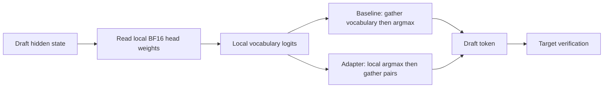

# Flash-Next: additions to Fable's Spark recipes

September 9, 2026. Isolated TP2 experiments against the pinned `8a728663` vLLM image and NVIDIA checkpoint `fc694b54`. Original registry files are unchanged. Nothing here is promoted as faster whole-model serving yet.

## Verdict on the existing work

Fable established the useful baseline: resident PLE on SGLang, no speculation for sufficiently concurrent traffic, and functioning first-pass prefix reuse on vLLM using `disable_eagle_block_drop`. Expert parallelism improved his vLLM depth/concurrency grid. These are his measured improvements, not new findings here.

The published registry README describes expert parallelism, but `recipes/flashnext-vllm-cached.yaml` omits `--enable-expert-parallel`. All four experiments here explicitly include it and `--all2all-backend allgather_reducescatter`. **Our control is therefore the EP configuration from Fable's results, not the literal shipped YAML.**

The previous Codex strict cache-group patch is retired. It rejected Flash-Next's legitimate shared target/MTP attention group 5 and failed before inference. Its CPU fixtures were insufficient. The older package's README and stale loading status now say so.

## Implemented

| Arm | Change from EP control | Purpose |
|---|---|---|
| [baseline](recipes/baseline.yaml) | None | Fable's six overlays, MTP3, no-drop workaround, FP8 KV, GMU .70, seq6, chunk4096 |
| [argmax](recipes/argmax.yaml) | `Qwen4ExpMTP.get_top_tokens()` adapter and `use_local_argmax_reduction` | Remove full-vocabulary communication during greedy drafting |
| [cache-coarse](recipes/cache-coarse.yaml) | Backport upstream PR53945; remove no-drop workaround | Correct replay boundaries with normal block-drop protection |
| [cache-fine](recipes/cache-fine.yaml) | Coarse arm plus `--prefix-match-unit 64 --enable-mamba-fine-grained-prefix-cache` | Test finer reuse of growing/changed prefixes |

Every arm retains the corrected ModelOpt loader, Fable's MTP group annotation, the same checkpoint, CX7 fabric, and private IPC. Cache and argmax changes are separate. The cache backport does not replace Fable's group annotation.

The [MTP patch](local-argmax/mtp.patch) delegates to vLLM's existing padding-aware, vocab-parallel greedy argmax. It adds no kernel or sampling algorithm. Full-vocabulary greedy drafting is required; reduced-vocabulary drafting and LoRA are not supported experiments here. It does not increase speculative acceptance by itself. Exact parity of this reduction is distinct from draft tokens being accepted by the target.

The [cache patch](cache-backport/pr53945.patch) is upstream commit `263c4ff95fadb62d80f315171b17d4f623494e56`, applied to the exact image with zero fuzz. The coarse repair and the opt-in fine-grained feature are different paths in the same PR; the fine-grained flag is not required for the coarse repair.



## Measurements and limitations

The real `ParallelLMHead`, real Flash-Next adapter and engine capability check ran across both GB10s over NCCL IB. Synthetic weights use the checkpoint's actual 248320 × 2560 shape. Random rows, cross-rank ties, large IDs and a separately padded vocabulary passed exact token parity, including CUDA-graph capture/replay.

CUDA-graph head-only median latency, 16 alternating-order samples, maximum rank time:

| Batch | Full gather | Local argmax | Time saved per head call |
|---:|---:|---:|---:|
| 1 | 3.733 ms | 3.721 ms | 0.012 ms / 0.3% |
| 4 | 2.940 ms | 2.824 ms | 0.116 ms / 4.0% |
| 8 | 2.990 ms | 2.838 ms | 0.153 ms / 5.1% |

Eager execution gave the same conclusion: negligible batch-1 benefit and modest batching benefit. [Graph samples](results/head-graph.json), [eager samples](results/head-eager.json). These are **head-only timings with synthetic weights**, not TG/PP gains or acceptance measurements. Batch 8 here does not imply the seq6 serving recipe admits eight simultaneous requests.

The adapter shrinks gathered BF16 logits from 496640 bytes per row to 16 bytes at TP2, but still reads **635699200 bytes of BF16 head weights per rank**. That explains why a 31040× smaller payload produces little single-stream benefit. This patch is useful capability work; it is not the principal bandwidth optimization.

The PR's real manager/scheduler tests and broader prefix-cache tests produced **110 passes and one failure**. The failure, `test_swa_reachable_block_mask_final_partial_segment`, also fails on the unpatched image because it lacks the newer `final_segment_end_block` API. The isolated regression command explicitly deselects that unrelated test; it does not silently weaken its assertion. Metadata tests do not certify model outputs or long-context correctness.

The small serving result and cluster state are recorded in [results/STATUS.json](results/STATUS.json). Do not interpret a planned/running boot as a completed result.

## Run with sparkrun

Run these from the repository root on **both nodes**, after copying this folder and the existing `mods/vllm-flashnext-nightly-8a728663` directory. Builds require no model load. The installer checks hashes of the original image sources before replacing any file.

```sh
python3 codex-optimization/test_package.py
docker build -f codex-optimization/Dockerfile --build-arg ARM=baseline -t flashnext-codex:20260909-baseline .
docker build -f codex-optimization/Dockerfile --build-arg ARM=argmax -t flashnext-codex:20260909-argmax .
docker build -f codex-optimization/Dockerfile --build-arg ARM=cache -t flashnext-codex:20260909-cache .
```

On the head node, choose one arm. The recipes use the existing sparkrun distributed runtime; there is no second model launcher.

```sh
sparkrun run codex-optimization/recipes/cache-fine.yaml --cluster dgx-cluster-cx7 --tp 2 --no-sync-tuning --dry-run
sparkrun run codex-optimization/recipes/cache-fine.yaml --cluster dgx-cluster-cx7 --tp 2 --no-sync-tuning --no-follow
# Stop only the exact cluster ID printed by that command:
sparkrun stop <experiment-cluster-id>
```

These recipe paths are for the local clone; they are not published registry aliases. TP1 serving/capacity is not validated by this package. Fabric values are for this pair's `f1` ports. No guard, host tuning, system service or existing recipe is modified.

The small acceptance gate is six requests: two independent ~20K-token prompts, each fresh/repeated/changed-suffix, exact-key retrieval, actual token usage, prefix-hit deltas, and no competing requests. The existing `cache-reuse/replay.py` harness from the older experimental repository is reused for this run. A passed gate is not an overnight-agent or 262K-context certification. Follow with growing/shrinking histories and needles at 16K → 32K → 64K → 128K → 210K before promotion.

## Reproduce the component checks

On each node simultaneously, using rank 0 on dgx-01 and rank 1 on dgx-02:

```sh
HEAD_MODE=graph bash codex-optimization/head-rank.sh 0  # dgx-01
HEAD_MODE=graph bash codex-optimization/head-rank.sh 1  # dgx-02
```

For cache metadata regressions on one node:

```sh
docker run --rm --gpus all -v "$PWD:/work" --entrypoint bash \
  vllm/vllm-openai:nightly-8a728663c1c3eeace834a95f5654fa653cc1998c \
  /work/codex-optimization/cache-tests.sh
```

## Next bandwidth work

The next head experiment should reduce **weight traffic**, not just the gathered output: an independently quantized draft-only FP8 head, while retaining the original target head and target verification. At TP2 its packed head would be about 303 MiB per rank, versus 606 MiB BF16. The added copy costs capacity, kernels must actually be faster on SM121, and changed draft rankings can lower acceptance. It needs measured real hidden-state agreement and net accepted-tokens/second before any serving patch is promoted. A standalone feasibility probe is in `probe_fp8_head.py`; no FP8 serving patch or novelty claim is made here.

For caching and PP, first judge the finer-checkpoint experiment. For concurrent agents, use Fable's no-spec comparison and then test two TP1 replicas if the checkpoint and required KV capacity fit. The nominal 273 GB/s is a hardware bandwidth rate, not a measured whole-model tok/s ceiling; effective bytes per **accepted** token and scheduler/collective time determine the result. Near-100% draft acceptance cannot be promised for arbitrary requests.

## Sources

- [vLLM PR53945: replay-boundary repair and optional fine-grained reuse](https://github.com/vllm-project/vllm/pull/53945), merged September 8, 2026. [Saved API evidence](research/pr-53945.json).
- [vLLM PR54713: alternate retention mechanism](https://github.com/vllm-project/vllm/pull/54713); Fable measured a one-block recompute penalty for his arm. [Saved evidence](research/pr-54713.json).
- [vLLM PR55390: shared target/draft attention grouping](https://github.com/vllm-project/vllm/pull/55390), still open when researched. [Saved evidence](research/pr-55390.json).
- [vLLM issue51561: heterogeneous vocabulary and local argmax](https://github.com/vllm-project/vllm/issues/51561).
- [Fable's public registry results](../results/RESULTS.md); detailed local overnight findings are in the older repository's `results/ALL-RESULTS.md`, section dated September 8/9.
- [Pinned original source hashes and image identity](source-lock.json). Upstream source and tests retain their license headers.
